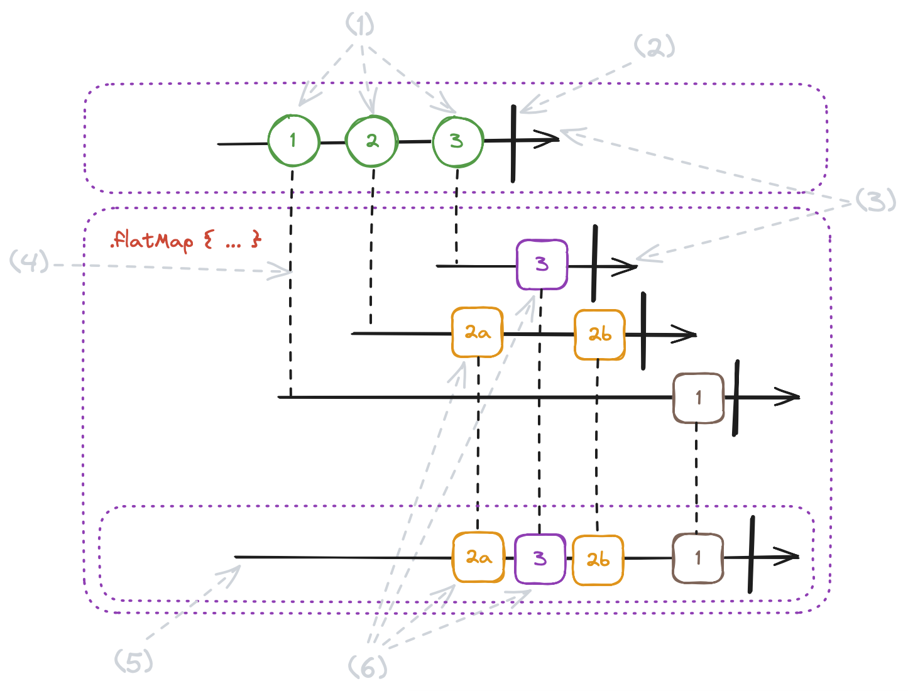
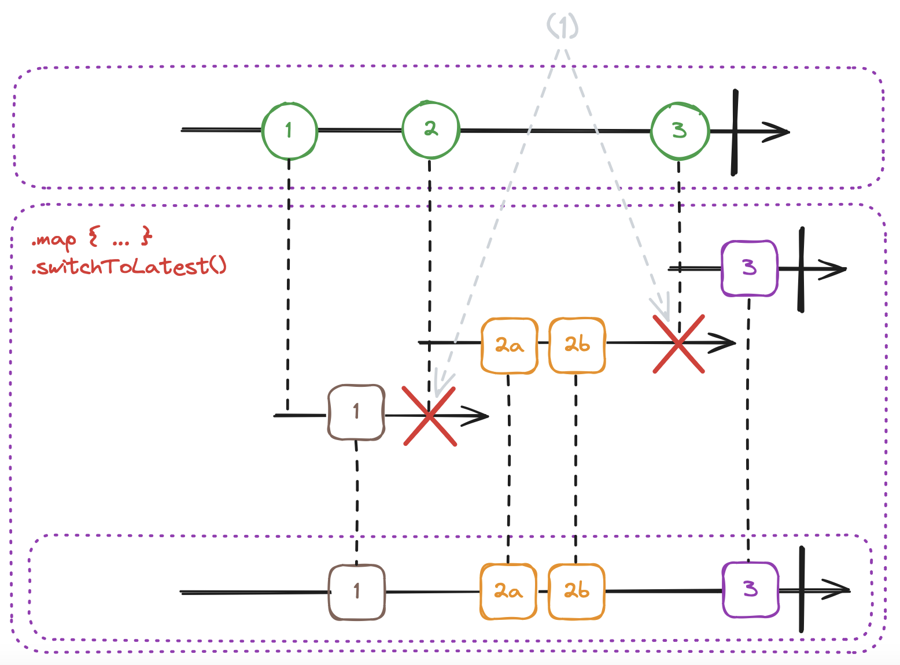

## Intro

Combine is a framework made by Apple designed to support us in writing code that could be way more complex if written in an imperative way. It's often said that with great power comes great responsibility. Therefore, as developers, it’s essential for us to understand how to harness this power, ensuring we don't hurt ourselves.

Today, we're going to take a closer look 👀 at a few Combine operators, showcasing their usage.

## Operators

### map

```swift
public func map<T>(
  _ transform: @escaping (Self.Output) -> T
) -> Publishers.Map<Self, T>
```

**In Combine, the map operator transforms each value from the upstream applying the provided transformation closure.**

The definition might sound complex but have a look at how simple it's in practice ⤵️.

```swift
[1, 2, 3]
    .publisher
    .map { String("Number: \($0)") }
    .sink(receiveValue: { print("RECEVIED VALUE: \($0)") })
    .store(in: &cancellables)
```

> 
```
RECEVIED VALUE: Number: 1
RECEVIED VALUE: Number: 2
RECEVIED VALUE: Number: 3
```


In the above example, we map `Int` values received from the upstream to `String` values and then we print them in the `receiveValue` closure.

Easy right? Let's jump to `flatMap` then!

### flatMap

```swift
public func flatMap<T, P>(
  maxPublishers: Subscribers.Demand = .unlimited, 
  _ transform: @escaping (Self.Output) -> P
) -> Publishers.FlatMap<P, Self> where T == P.Output, P : Publisher, Self.Failure == P.Failure
```

**The flat map operator transforms each value from the upstream into a new Publisher applying the provided transformation closure.**

Clear? Yass 🤯

**Check the image for a more detailed explanation ⤵️.**



- (1) - events in a stream. The first emitted event is with a number 1,
- (2) - stream completion,
- (3) - streams,
- (4) - each new upstream event triggers subscription to a new stream,
- (5) - events observed by the `flatMap` subscriber,
- (6) - each upstreams event is republished to the down stream.

**If it's still unclear, I come to the rescue 🛟 with the code example ⤵️.**

```swift
var cancellables = Set<AnyCancellable>()

func request(number: Int) -> AnyPublisher<Int, Never> { // 1
    Just(number)
        .delay(for: .seconds((1...2).randomElement()!), scheduler: DispatchQueue.main) // 2
        .handleEvents(
            receiveSubscription: { _ in print("REQUEST \(number) STARTED") }, 
            receiveCompletion: {
                switch $0 {
                case .finished:
                    print("REQUEST: \(number) FINISHED")
                case .failure:
                    fatalError()
                }
            },
            receiveCancel: { print("REQUEST \(number) CANCELLED") }
        )
        .eraseToAnyPublisher()
}

Array([1, 2, 3]) // 3
    .publisher // 4
    .flatMap { number in request(number: number) } // 5
    .sink( // 6
        receiveCompletion: {
            switch $0 {
            case .finished:
                print("STREAM FINISHED")
            case .failure:
                fatalError()
            }
        }, 
        receiveValue: { value in print("RECEIVED VALUE \(value)") }
    )
    .store(in: &cancellables)
```
> 
```
REQUEST 1 STARTED
REQUEST 2 STARTED
REQUEST 3 STARTED
RECEIVED VALUE 1
REQUEST 1 FINISHED
RECEIVED VALUE 3
REQUEST 3 FINISHED
RECEIVED VALUE 2
REQUEST 2 FINISHED
STREAM FINISHED
```


- // 1 - the function `request` emits a single value (using `Just` publisher) which represents the result of a faked API request. The result is published with a delay to simulate the real async request,
- // 2 - the `delay` operator that delays the flow of elements through the stream for a given amount of time and publishes using a specified scheduller,
- // 3 - definition of static array of elements,
- // 4 - the `publisher` operator transforms a static array of elements into a stream of the array elements. Each element is sent down the stream one by one (one event per each element),
- // 5 - the `flatMap` operator takes each element from the upstream and transforms it into a new stream. In our case, it takes each element of the array (// 3) and transforms it into a new stream using the `request` function (// 1),
- // 6 - the `sink` operator that attaches the subscriber to the stream and observes elements published by it. In our case, it observes and prints out each received value and the stream completion.

**What can be a real life usage of `flatMap`?**

Imagine that you have a messaging app. To get a single thread with all messages you need to perform one request, so in case you have 10 threads, you perform 10 requests, to get each thread.

pseudocode ⤵️

```swift
getThreadsIDs() // 1
    .flatMap(\.publisher)
    .map(ThreadDetailsRequest.init) // 2
    .flatMap { request in
        apiService.execute(request: request) // 3
            .catch { _ in Empty(completeImmediately: true) } // 4
    }
    .sink(receiveValue: { response in threadDetailsStorage.insert(response.threadDetails) }) // 5
    .store(in: &cancellables)
```

- // 1 - the stream that publishes the Array of threads IDs (`AnyPublisher<[String], Error>`),
- // 2 - maps ID (`String`) to a request model,
- // 3 - each request is converted into a new publisher that represents API request,
- // 4 - `flatMap` does not ignore errors! In that case `catch` operator intercepts an error replaces it with `Empty` publisher. Empty publisher does not emit any error or element into downstream, but completes the stream. In case we don't handle errors, the main stream would be completed with error and no more events would be observed,
- // 6 - `sink` operator that attaches subscriber to the stream and observe elements in the main stream. In our case we save fetched thread details into local cache.

### map + switchToLatest

```swift
public func switchToLatest() -> Publishers.SwitchToLatest<Self.Output, Self>
```
According to the docs ⤵️

> Republishes elements sent by the most recently received publisher.
>
> ~ [Apple Docs](https://developer.apple.com/documentation/combine/publisher/switchtolatest()-453ht)

**Check out the schema for more details ⤵️**


(most of the elements are already described on the `flatMap` schema 👀)
- (1) - when a new publisher arrives from the upstream, `switchToLatest` cancels the previous publisher subscription and subscribes to a new one.

**Code example ⤵️**

```swift
var cancellables = Set<AnyCancellable>()

func request(number: Int) -> AnyPublisher<Int, Never> {
    Just(number)
        .delay(for: .seconds((1...2).randomElement()!), scheduler: DispatchQueue.main)
        .handleEvents(
            receiveSubscription: { _ in print("REQUEST \(number) STARTED") }, 
            receiveCompletion: {
                switch $0 {
                case .finished:
                    print("REQUEST \(number) FINISHED")
                case .failure:
                    fatalError()
                }
            },
            receiveCancel: { print("REQUEST \(number) CANCELLED") }
        )
        .eraseToAnyPublisher()
}

Array([1, 2, 3])
    .publisher
    .map { number in request(number: number) } // 1
    .switchToLatest() // 2
    .sink(
        receiveCompletion: {
            switch $0 {
            case .finished:
                print("STREAM FINISHED")
            case .failure:
                fatalError()
            }
        },
        receiveValue: { value in print("RECEIVED VALUE \(value)") }
    )
    .store(in: &cancellables)
```
> 
```
REQUEST 1 STARTED
REQUEST 1 CANCELLED
REQUEST 2 STARTED
REQUEST 2 CANCELLED
REQUEST 3 STARTED
RECEIVED VALUE 3
REQUEST 3 FINISHED
STREAM FINISHED
```

- // 1 - each number conversion to `AnyPublisher<Int, Never>` that represents an API request,
- // 2 - `switchToLatest` subscribes to the latest publisher emitted from the upstream and cancels the previous subscription.

**Real-life use case for `map + switchToLatest`**

pseudocode ⤵️

```swift
searchBar
    .publisher(for: .text) // 1
    .map(SearchRequest.init) // 2
    .map { request in
        apiService.execute(request: request) // 3
            .catch { _ in Empty(completeImmediately: true) } // 4
    }
    .switchToLatest() // 5
    .sink(receiveValue: { result in dataSource = result.searchResults }) // 6
    .store(in: &cancellables)
```

- // 1 - publisher of elements from the search bar text field,
- // 2 - each text element is mapped to the request model (`SearchRequest`),
- // 3 - each request is converted into a new publisher that represents the API request,
- // 4 - `switchToLatest` does not ignore errors! In that case `catch` operator intercepts an error and replaces it with `Empty` publisher. Empty publisher does not emit any error or element downstream but completes the stream. In case errors are not handled, the mainstream would be completed with error and no more events would be observed,
- // 5 - subscribes to the latest publisher from the upstream and cancels the previous subscription,
- // 6 - `sink` operator that attaches the subscriber to the stream and observes elements in the mainstream. In our case, the data source is modified by assigning the request result.

**What's the difference comparing to the `flatMap`?**

`flatMap` republishes all publisher's events and `map + switchToLatest` only the latest one and previous ones are canceled. 

**What's the benefit of `map + switchToLatest` usage?**

Using `map + switchToLatest` may help you with reducing API operations when the previous operation becomes redundant.

## Final Takeaways 🧠

- Think about your use case and a stream behavior that you want to achieve.
- `flatMap` subscribes to each new publisher and lets them all republish elements to the downstream.
- `map + switchToLatest` lets the latest publisher republish elements to the downstream, the rest of the streams are canceled. It may help you with reducing redundant API requests.
- `flatMap`, `map + switchToLatest` do not ignore errors. In case any publisher fails it'll end the mainstream and no more events will be published. If it's not desired behavior, remember about error handling.
- When a stream is canceled no more events will be published (including completion).

---

Thanks for reading the first post on my blog 📖. 

I hope you learned something new today!

If you enjoy the topic follow me on one of my social media or via RSS feed.
