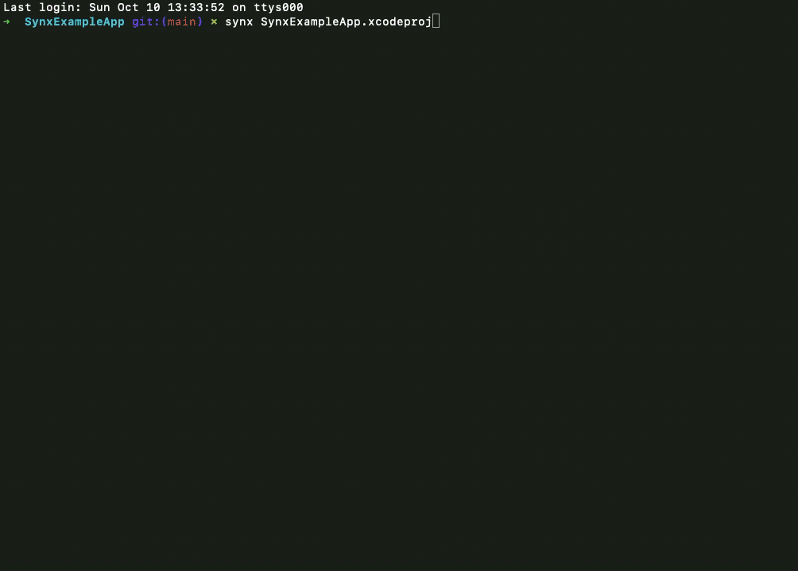

A tool written in Ruby which can keep your project and a .pbxproj file clean. A valuable ally when solving complex conflicts inside the project file.

Keeping a project file clean during a project life could be tough especially while working in a team, and we conflict our branches from time to time. Solving multiple conflicts in a .pbxproj can lead to mistakes that can cause duplicated references, not removed old references, or files not referenced by a project, but still existing in a project directory. In today’s article, I’ll share my tips on how to deal with described problems pretty easily.

### synx

According to docs [synx](https://github.com/venmo/synx) is

> A command-line tool that reorganizes your Xcode project folder to match your Xcode groups.

The tool is written in Ruby and distributed via Ruby gems, which makes the installation process simple

```sh
$ gem install synx
```

**Before execution make sure that you have your changes committed.**

After the installation, all you need is to pass a path to your .xcodeproj file

```sh
$ synx SynxExampleApp.xcodeproj
```

Voilà! You should see how an output is generated (time of execution depends on the number of files in a project).



### What’s just happened?

- Missing files detected. AFile.swift and ZFile.swift are referenced by the project, but swift files are missing.


- Not referenced files detected. Files structure contains one more directory (Details), which is not referenced by the project, but the directory with subfolders and files exists on the disc.


- Files sorted alphabetically and by type
- Duplicated and invalid references in .pbxproj were removed

Now fix all the issues listed in an output and enjoy a clean .pbxproj file.

### Bonus

I bet that everyone who uses Xcode and works together with a bigger team on the one project has had conflicts which they basically didn’t know to solve. Those conflicts occur very often when project structure is changed on different branches.

Thanks to the above mentioned benefits regarding fixing .pbxproj file issues there is one more interesting usage of this tool. It can be used for solving complex conflicts inside .pbxproj file.

When dealing with conflicts in the .pbxproj choose a correct option only if you know exactly that you’re right. Otherwise, go for the version “choose both”.


After going through all the conflicts save a file and run synx. Based on an output clean old files or create missing references.


**The tool is not designed for resolving conflicts in the way described here, so it’s likely that it won’t always be possible to solve super complex conflicts by using it.**

---

Thanks for reading the first post on my blog. 📖

I hope you found it useful!

If you enjoy the topic don't forget to follow me on one of my social media or via RSS feed to keep up to speed. 🚀
