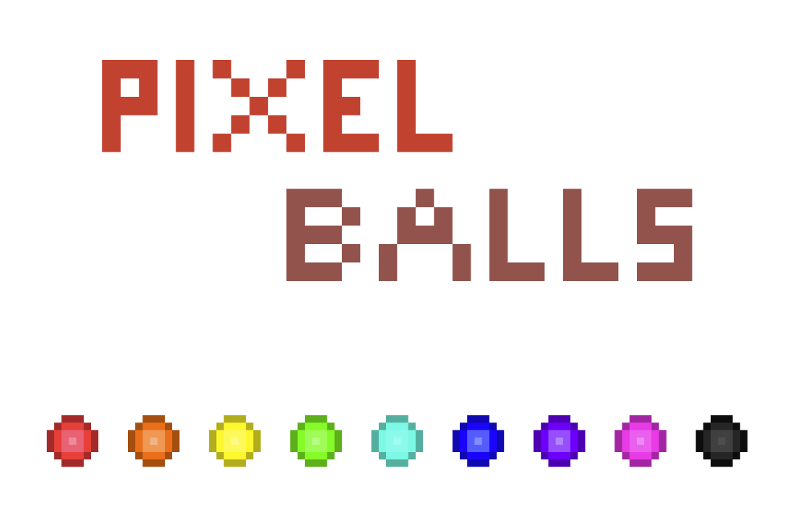
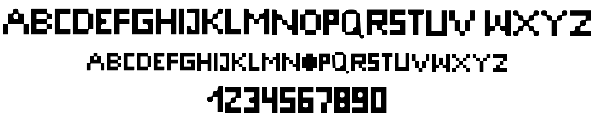
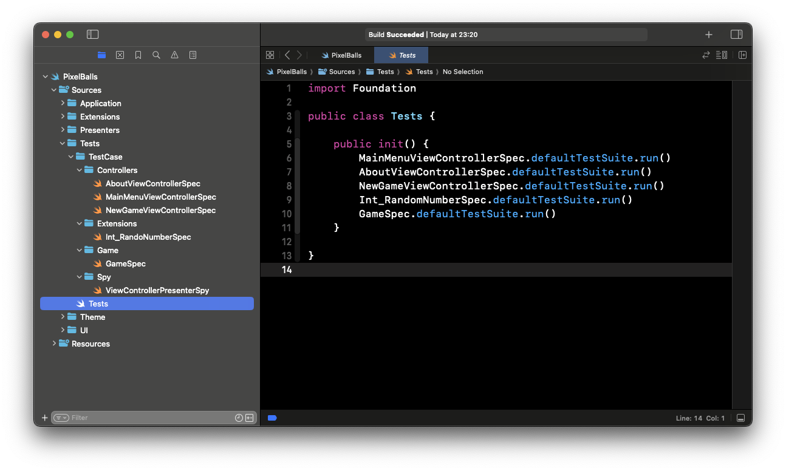
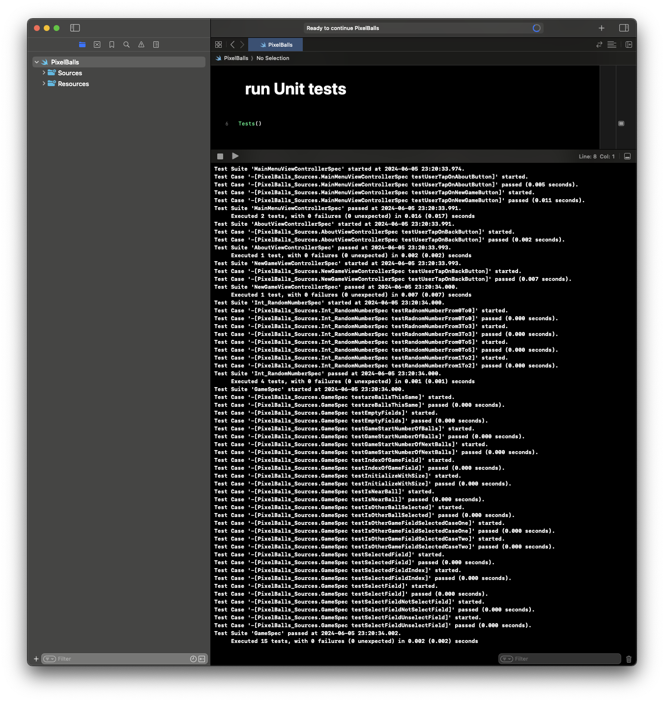
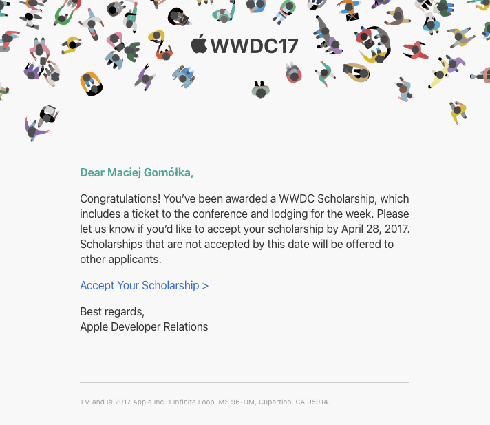
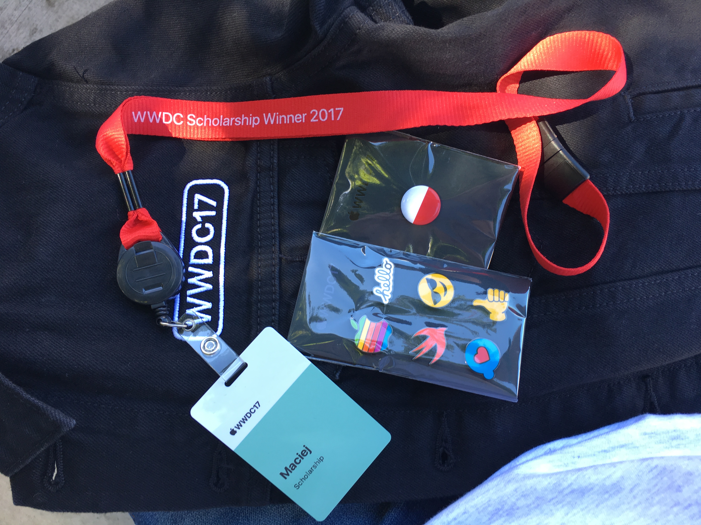

## Intro

This year’s WWDC is just around the corner, and I decided to write about how I ended up at WWDC in 2017. At that time, I was a computer science student and Apple was organizing Swift Student Challange for which I was eligible for. As a young iOS apprentice, I couldn't miss this opportunity - I signed up. How did I get there? That's what I want to share with you today. ⤵️

## Scholarship submission

How the scholarship submission looked like in 2017? It was split into two parts: 
- Swift Playground - the goal was to create a project using Swift Playground showcasing something interesting.
- submission form - completed form with few written answers. I cannot re-call what were the exact questions, but it was something in "Why should we choose you?" style.

### Pixel balls

My idea for the Playground was creating a mini game in UIKit.

The rules are very simple. You need to choose one ball on the playground and move it to empty field. After making a move next 3 balls are displayed at the playground. You have to set a minimum 5 balls vertically, horizontally or diagonally. After that the balls disappear and you gain points.

Way to the empty field can be blocked by another balls. In this situation you can't place there any balls.

You can find out how it looks here ⤵️


 

What made my submission unique? In my opinion it was:
- pixel art design - I created all assets pixel by pixel including the title and balls and everything that looks pixel style. 👾

- custom pixel font - yes, first time (and so far only) I created my own font to make it looks pixel style in the way I imagined it. 💭

- unit tests - that might be surprising too, especially for the iOS apprentice. Have you ever seen unit tests written in Swift Playground? If not - have a look here ⤵️

### Result

As you probably already guessed, I was accepted. 🎉

## Final words

I'm glad that I could take part in such a great and important event for Swift community. After 7 years, I can hardly believe that I was actually sitting there watching Keynote live. I hope to go back there someday and once again have an opportunity to meet iOS coders from all over the world. 🌎

Before writing the blog post, I updated my submission project - Pixel Balls 👾 to run in Xcode 15.4. You can find it here - https://github.com/Zaprogramiacz/PixelBalls-WWDC2017

---

Thanks for reading. 📖

I hope you found it interesting!

If you enjoy the topic don't forget to follow me on one of my social media or via RSS feed to keep up to speed. 🚀
