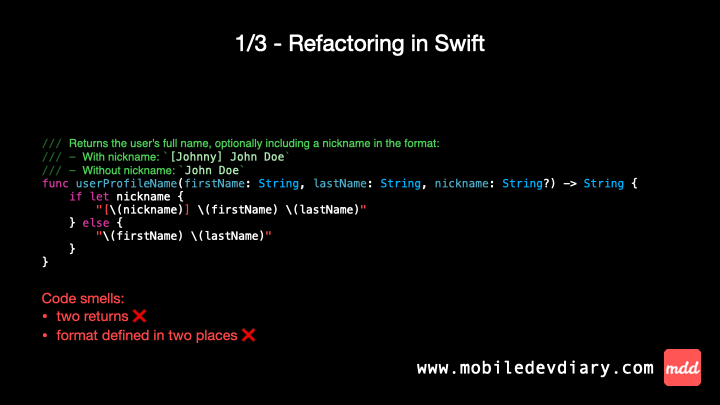

Swift code refactor in action 👨🏻‍💻

Common scenario: formatting user profile name - I bet any of you faced this kind of task. 

At first glance, it look straightforward, but when you take a closer look, you’ll notice two potential improvements:
1️⃣ One single return - simplification of the the function flow.
2️⃣ Centralised formatting logic - reduces the chance of bugs.

Check out the animated gif and the code where I refactor to address these issues.

Advice: The easiest and fastest way to validate your refactor is to have the code unit tested, so remember to test it before you start refactoring!

Gif ⤵️



Code ⤵️

#1
```swift
/// Returns the user's full name, optionally including a nickname in the format:
/// - With nickname: `[Johnny] John Doe`
/// - Without nickname: `John Doe`
func userProfileName(firstName: String, lastName: String, nickname: String?) -> String {
    if let nickname {
        "[\(nickname)] \(firstName) \(lastName)"
    } else {
        "\(firstName) \(lastName)"
    }
}
```

#2
```swift
/// Returns the user's full name, optionally including a nickname in the format:
/// - With nickname: `[Johnny] John Doe`
/// - Without nickname: `John Doe`
func userProfileName(firstName: String, lastName: String, nickname: String?) -> String {
    nickname.map { nickname in ["[\(nickname)]", firstName, lastName].joined(separator: " ") }
        ?? [firstName, lastName].joined(separator: " ")
}
```

#3
```swift
/// Returns the user's full name, optionally including a nickname in the format:
/// - With nickname: `[Johnny] John Doe`
/// - Without nickname: `John Doe`
func userProfileName(firstName: String, lastName: String, nickname: String?) -> String {
    [nickname.map { nickname in "[\(nickname)]" }, firstName, lastName]
        .compactMap { $0 }
        .joined(separator: " ")
}
```

---

Thanks for reading. 📖

I hope you found it useful!

If you enjoy the topic don't forget to follow me on one of my social media - [LinkedIn](https://www.linkedin.com/in/maciej-gomolka/), [X](https://twitter.com/gomolka_maciej) or via [RSS](https://www.mobiledevdiary.com/index.xml) feed to keep up to speed. 🚀
