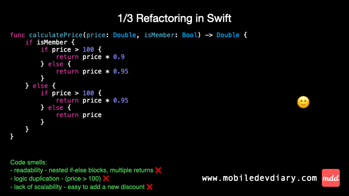

Swift code refactor in action 👨🏻‍💻

Today, let’s talk about refactoring for clarity, maintainability, and scalability!

This time, the scenario is calculating the final price depending on the price and membership status.

This initial code has a few code smells:
- 1️⃣ nested ifs - impacts general readability, making the code hard to understand,
- 2️⃣ duplicated conditions - "price > 100" which violates the Don’t Repeat Yourself principle,
- 3️⃣ lack of scalability - not possible to easily add a new discount, it’d require to rework everything.

Checkout the gif or the post on my website to see how I solve these code smells and make the code cool, clean and scalable!

Gif ⤵️



Code ⤵️

#1
```swift
func calculatePrice_v1(price: Double, isMember: Bool) -> Double {
    if isMember {
        if price > 100 {
            return price * 0.9
        } else {
            return price * 0.95
        }
    } else {
        if price > 100 {
            return price * 0.95
        } else {
            return price
        }
    }
}
```

#2
```swift
func calculatePrice_v2(price: Double, isMember: Bool) -> Double {
    isMember ? priceForMember(price: price) : priceForNonMember(price: price)
}

func priceForMember(price: Double) -> Double {
    price > 100 ? price * 0.9 : price * 0.95
}

func priceForNonMember(price: Double) -> Double {
    price > 100 ? price * 0.95 : price
}
```

#3
```swift
func calculatePrice_v3(price: Double, isMember: Bool) -> Double {
    apply(discount: isMember ? .member : .regular, to: price)
}

func apply(discount: Discount, to price: Double) -> Double {
    price > discount.threshold ?
        price * discount.premiumRate : price * discount.standardRate
}

struct Discount {
    let threshold: Double
    let standardRate: Double
    let premiumRate: Double

    static let member = Discount(threshold: 100, standardRate: 0.95, premiumRate: 0.9)
    static let regular = Discount(threshold: 100, standardRate: 1, premiumRate: 0.95)
}
```


