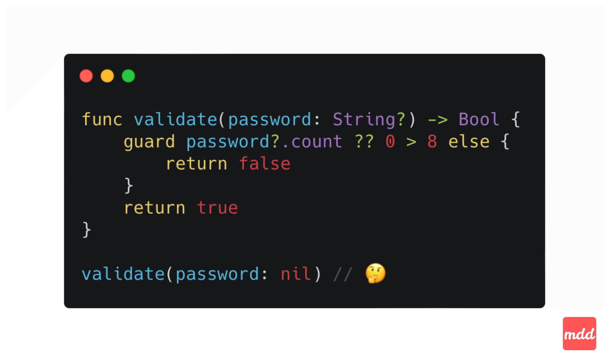

Swift code refactor in action 👨🏻‍💻

Take a close look at the validate function. There's a sneaky problem hidden in this code snippet.
- What will the function call return when passed `nil`?
- What problem is hidden here?



First, the guard statement is redundant here. We can simplify the function to ⤵️

```swift
func validate(password: String?) -> Bool {
    password?.count ?? 0 > 8
}
```

There's no need to wrap password?.count ?? 0 in parentheses since the `??` operator already has higher precedence than `>`.

Second, there's a logical issue with the function signature. Does it make sense for the password to be optional? In my opinion, no. Logically, when validating a password, I'd assume the password already exists, and the argument should be non optional ⤵️

```swift
func validate(password: String) -> Bool {
    password.count > 8
}
```

Notice how clear the validation rule becomes now - it's immediately understandable without any extra thinking.

If the text value is exposed by UI component as optional, we can conveniently handle this by introducing a simple extension ⤵️

```swift
extension Optional where Wrapped == String {
    var orEmpty: String {
        self ?? ""
    }
}
```

Code snippet with full version ⤵️



