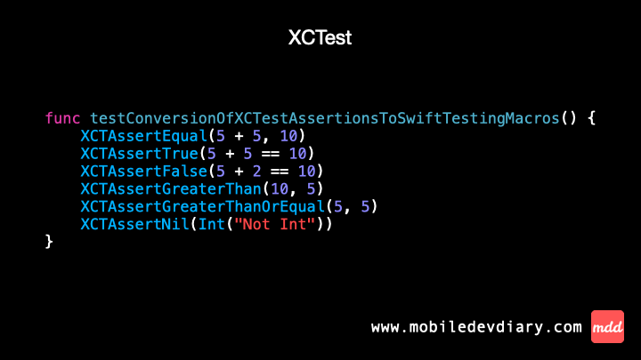

New Series! XCTest vs. Swift Testing - fresh look on a new testing framework.

Swift Testing was presented at WWDC24 as a new, modern, simplified framework for writing automated tests. It's a perfect candidate to replace XCTest unit tests, so it's definitely worth learning.

I haven’t had a chance yet to use Swift Testing in production and the series is my motivation for me to discover it.

Today we cover 2 basic differences ⤵️

1️⃣ No more "test" prefix in test names. 
In XCTest each test name has to start with the "test" prefix. In Swift Testing Xcode recognise a test by a new macro "@Test".

2️⃣ Unified way of checking test results with `#expect`
In XCTest there are assertions: `XCTAssertEqual`, `XCTAssertTrue`, `XCTAssertNil`, …
Swift Testing simplifies that with a single macro `#expect`. So now `XCTAssertTrue(1 + 1, 2)`, becomes `#expect(1 + 1 == 2)`.

I’m definitely a fan of the `@Test` macro as this small change makes the testing code cleaner. However I’m not 100% sure about replacing all assertions with one macro. What makes me think it was a good idea - is a simplification and making on single verification function instead of several ones. Maybe more experience with Swift Testing will convince me to have a stronger opinion about it… ?

Gif ⤵️



Code ⤵️

XCTest
```swift
func testConversionOfXCTestAssertionsToSwiftTestingMacros() {
    XCTAssertEqual(5 + 5, 10)
    XCTAssertTrue(5 + 5 == 10)
    XCTAssertFalse(5 + 2 == 10)
    XCTAssertGreaterThan(10, 5)
    XCTAssertGreaterThanOrEqual(5, 5)
    XCTAssertNil(Int("Not Int"))
}
```

Swift Testing
```swift
@Test 
func conversionOfXCTestAssertionsToSwiftTestingMacros() {
    #expect(5 + 5 == 10)
    #expect(5 + 5 == 10)
    #expect(5 + 2 != 10)
    #expect(10 > 5)
    #expect(5 >= 5)
    #expect(Int("Not Int") == nil)
}
```


