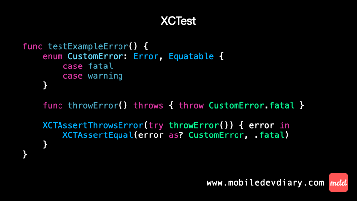

Today we check how testing error has changed in the new framework.

In XCTest, we use `XCTAssertThrowsError` to check if a specific error is thrown. This assertion comes with the error handler closure where we can perform additional checks like e.g. verifying the exact error type. 

With Swift Testing, this process is even simpler, especially when an error conforms to `Equatable`. We can directly specify the expected error in the expect macro and it automatically checks the type.

To me, this change makes the test simpler and easier to follow. In the end we have less lines to write and read, right? 😅

Gif ⤵️



Code ⤵️

XCTest
```swift
func testExampleError() {
    enum CustomError: Error, Equatable {
        case fatal
        case warning
    }

    func throwError() throws { throw CustomError.fatal }

    XCTAssertThrowsError(try throwError()) { error in
        XCTAssertEqual(error as? CustomError, .fatal)
    }
}
```

Swift Testing
```swift
@Test
func exampleError() {
    enum CustomError: Error, Equatable {
        case fatal
        case warning
    }

    func throwError() throws { throw CustomError.fatal }

    #expect(throws: CustomError.fatal, performing: throwError)
}
```

---

Thanks for reading. 📖

I hope you found it useful!

If you enjoy the topic don't forget to follow me on one of my social media - [LinkedIn](https://www.linkedin.com/in/maciej-gomolka/), [X](https://twitter.com/gomolka_maciej) or via [RSS](https://www.mobiledevdiary.com/index.xml) feed to keep up to speed. 🚀
