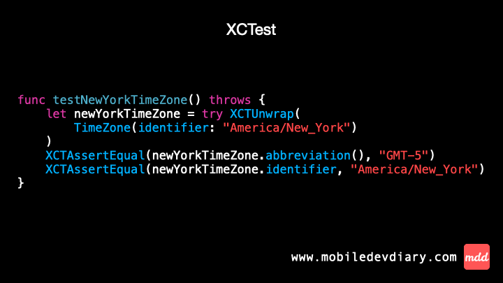

Optionals are a core of Swift - we deal with them daily, both in production and testing code. Whether you write tests with XCTest or Swift Testing, unwrapping optionals is a common case.

In XCTest there is `XCTUnwrap` operator.

Swift Testing introduces `#require` macro.

Is there any difference between them? Not really! Both require the test function to handle exceptions and `try` keyword before.

Gif ⤵️



Code ⤵️

XCTest
```swift
func testNewYorkTimeZone() throws {
    let newYorkTimeZone = try XCTUnwrap(
        TimeZone(identifier: "America/New_York")
    )
    XCTAssertEqual(newYorkTimeZone.abbreviation(), "GMT-5")
    XCTAssertEqual(newYorkTimeZone.identifier, "America/New_York")
}
```

Swift Testing
```swift
@Test
func newYorkTimeZone() throws {
    let newYorkTimeZone = try #require(
        TimeZone(identifier: "America/New_York")
    )
    #expect(newYorkTimeZone.abbreviation() == "GMT-5")
    #expect(newYorkTimeZone.identifier == "America/New_York")
}
```

---

Thanks for reading. 📖

I hope you found it useful!

If you enjoy the topic don't forget to follow me on one of my social media - [LinkedIn](https://www.linkedin.com/in/maciej-gomolka/), [X](https://twitter.com/gomolka_maciej) or via [RSS](https://www.mobiledevdiary.com/index.xml) feed to keep up to speed. 🚀
