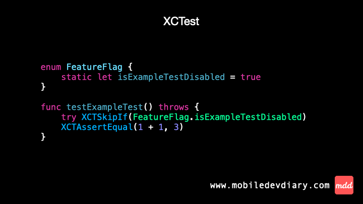

Today we check the diff in conditional disabling.

- In XCTest there is `XCTSkipIf` function that takes `Bool` argument to decide whether a test should run or not.
- In Swift Testing there’s "disable" trait accepting `Bool` argument and behaving like `XCTSkipIf` from XCTest.

XCTSkipIf - are you surprised this kind of function exists? To be honest - I was

I can admit I learned about it when preparing this post. This already shows how often I’ll be using the Swift Testing version of it, but never say never!

Anyway, Swift Testing lets you move the disabling logic outside of the test body, giving it a cleaner, more intuitive syntax. For me, that’s a win over XCTest.



Code ⤵️

XCTest
```swift
enum FeatureFlag {
    static let isExampleTestDisabled = true
}

func testExampleTest() throws {
    try XCTSkipIf(FeatureFlag.isExampleTestDisabled)
    XCTAssertEqual(1 + 1, 3)
}
```

Swift Testing
```swift
enum FeatureFlag {
    static let isExampleTestDisabled = true
}

@Test(.disabled(if: FeatureFlag.isExampleTestDisabled))
func exampleTest() throws {
    #expect(1 + 1 == 3)
}
```


