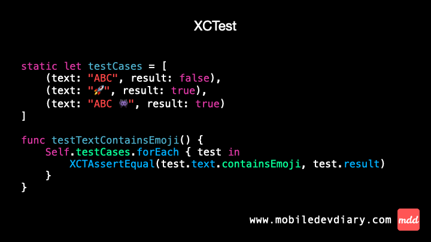

### What’s the difference?

XCTest doesn't provide a built-in solution for parameterized tests. To achieve this, we create test cases as structs or tuples, defining test inputs and expected results. Then, we write a loop to iterate through these test cases and execute the necessary assertions.

Swift Testing simplifies this process by allowing tests to be parameterized directly. Using the `@Test` macro, you can pass test cases as an argument. What's the benefit? While you still need to define your test cases, the iteration code is no longer needed — Swift Testing handles it for you.

### My thoughts

I'm obviously glad to see the code simplification! As a software developer, I enjoy writing less code to achieve the same results. Looking at it with a skeptical eye — it's not a groundbreaking change that will revolutionize how we write tests. However, it's a satisfying improvement that may encourage developers to rethink how they write tests and potentially adopt this pattern where it makes sense.

### Examples



Code ⤵️

XCTest
```swift
static let testCases = [
    (text: "ABC", result: false),
    (text: "🚀", result: true),
    (text: "ABC 👾", result: true)
]

func testTextContainsEmoji() {
    Self.testCases.forEach { test in
        XCTAssertEqual(test.text.containsEmoji, test.result)
    }
}
```

Swift Testing
```swift
static let testCases = [
    (text: "ABC", result: false),
    (text: "🚀", result: true),
    (text: "ABC 👾", result: true)
]

@Test(arguments: testCases)
func textContainsEmoji(testCase: (text: String, result: Bool)) {
    #expect(testCase.text.containsEmoji == testCase.result)
}
```


