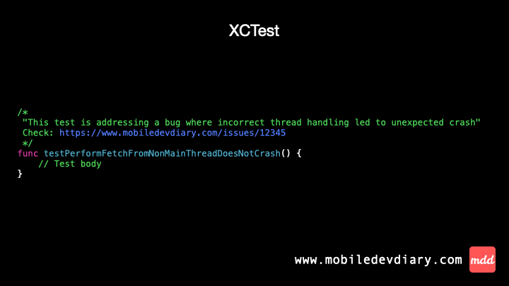
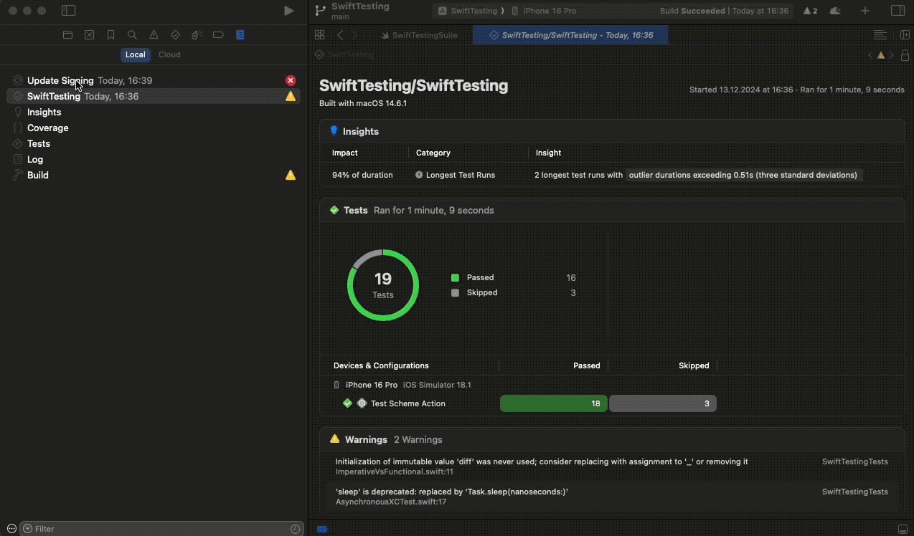

### What’s the difference?

In XCTest we relied on the old fashioned simple comments to add more context to our test case e.g link to the bug description.

With Swift Testing, we now have a special `bug` trait that can be passed to the `@Test` macro. The `bug` trait takes a URL String as argument and optionally a title for the bug allowing us to add short description of it. The key advantage over regular comment is that the bug title is visible in the test results. Better yet, tapping on it takes you directly to the related webpage with the bug report.

### My thoughts

I'm happy to see a consistent way to link tests with bugs in a bug tracking system. To be honest, I rarely comment on my tests - I believe a test name should be self-descriptive. I see the potential for this feature when doing bug fixing in TDD. You can start by writing a test and adding a link to the bug in a bug tracking system. Later, when the bug is fixed, the link can serve as a proof that the particular bug is covered by automated tests. I highly recommend the approach of fixing bugs in TDD!

I struggled a bit with finding where I can see the link to issue tracker in tests results (check out the last GIF). However, I’m optimistic about the potential of this feature and excited to see how it evolves in the future!

### Examples



Code ⤵️

XCTest
```swift
/*
 "This test is addressing a bug where incorrect thread handling led to unexpected crash"
 Check: https://www.mobiledevdiary.com/issues/12345
 */
func testPerformFetchFromNonMainThreadDoesNotCrash() {
    // Test body
}
```

Swift Testing
```swift
@Test(.bug(
    "https://www.mobiledevdiary.com/issues/12345",
    "This test is addressing a bug where incorrect thread handling led to unexpected crash"
))
func testPerformFetchFromNonMainThreadDoesNotCrash() {
    // Test body
}
```

Location of the bug button ⤵️





