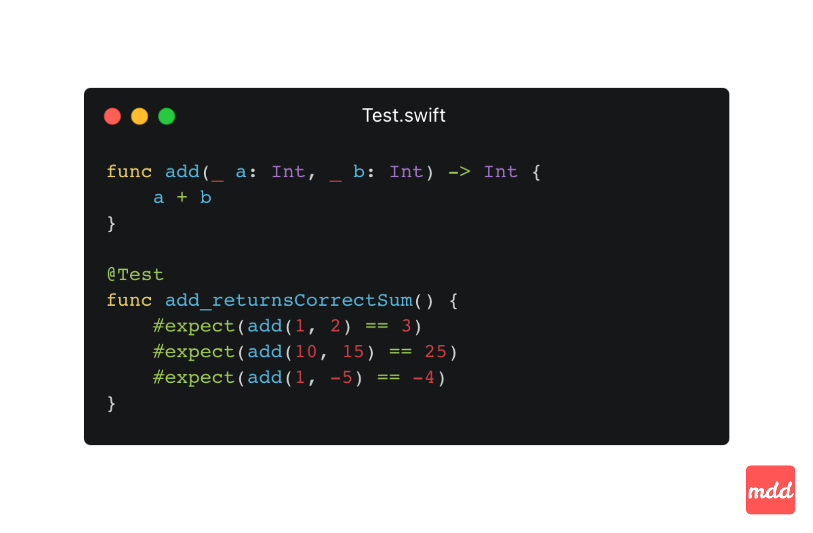
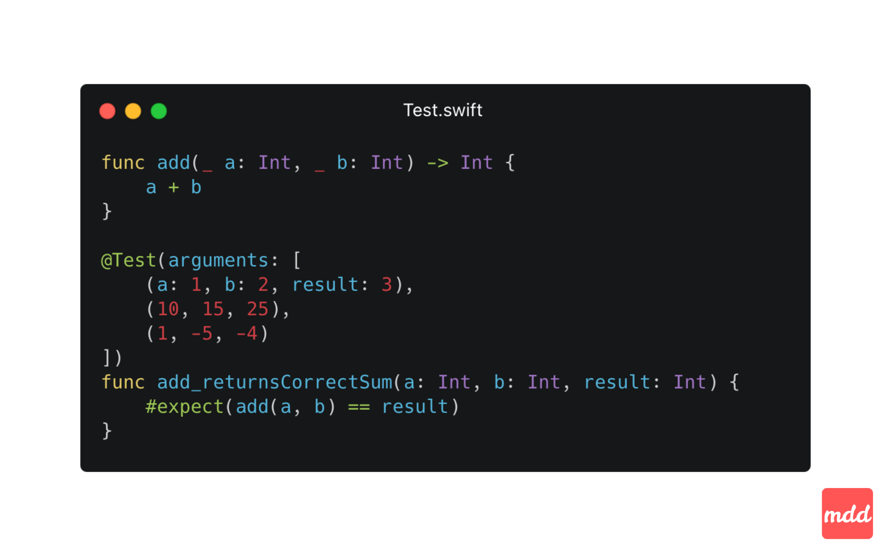
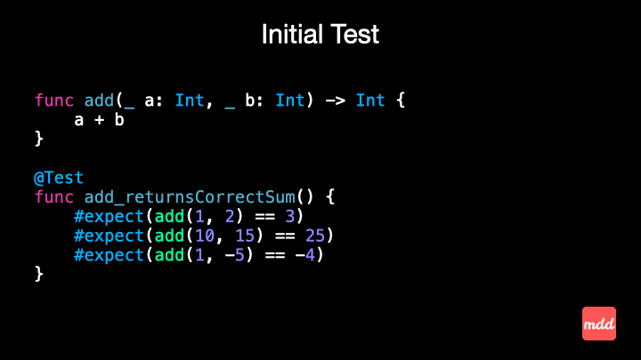

## Intro

Have you already started using Swift Testing instead of XCTest?

I'm curious to see how you can refactor the test function (`add_returnsCorrectSum`) from the code snippet to use all powers of the Swift Testing framework.

Could you explain what benefits does your refactored version has compared to my original code snippet?

## My approach

In both approaches the test gives the same result. 

The point is the refactored version uses a Swift Testing parametrised test, and this makes a real difference.

So, what are the benefits of using parameterised tests over non-parameterised ones?

1️⃣ Better test output reporting - in parametrised tests, each input is considered as separate test case and appears on it's own line in the test report. This makes it easier to quickly spot which input caused a failure.

2️⃣ Readability - the refactored test is reduced to a single tested function call. This shows that using parametrised tests we're able to cut down on code duplication and make easier to understand the behaviour under test.

3️⃣ Scalability - Adding a new test case is straightforward - you just add a new input and expected output. When the API of tested functionality changes, you only need to update it once.

## Final Advice 🧐
When you find yourself repeating the same scenario with different inputs and expected outputs, always use parameterised tests. Try to look these patterns in your code and refactor using parametrised tests!


