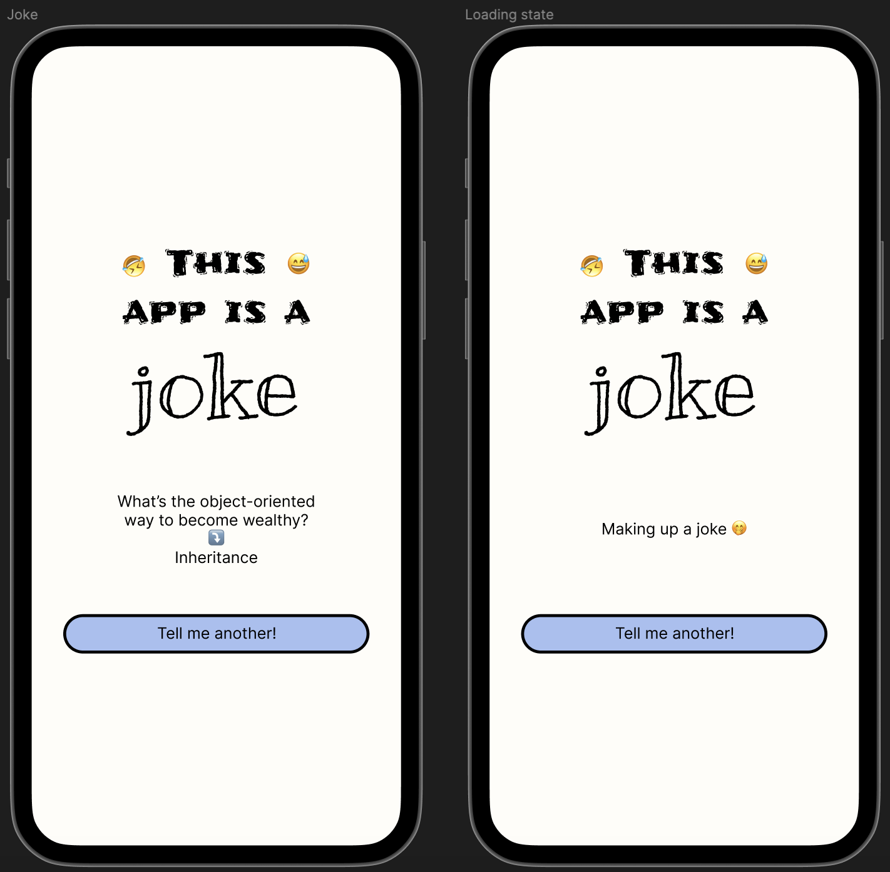

## Intro

- wiele razy no social mediach widziałem komentarze na temat testowalności (a właściwie braku testowalności) kodu napisanego w SwiftUI. Wiedziałem o istnieniu narzędzi tworzonych przez open source community i chciałem się przekonać jak to jest z tą testowalnością
- obecnie na codzień zajmuje się aplikacją która nie używa SwiftUI i chciałbym nadrobić zaległości w SwiftUI a zwłaszcza w toolingu do testów tworzonego przez community
- aby nie tworzyć długiego posta którego postanwoiłem podzielić go na conajmniej 2 części. W pierwszej części przedstawię requirementsy i zajmę się zaimplementowaniem części UI, a w drugiej części logiki biznesowej
- co użyjemy SwiftUI, async await, jeżeli chodzi o architekturę to nie będziemy się początkowo na tym skupiać ale po napisaniu testów spróbujemy zrobić refaktor i wpraowdzić jakiś prosty Redux żeby sprawdzić czy nasze testy pomogą nam podczas refaktoru
- testy mają nam pomóc i umożliwiać łatwy refaktor

## Chapter I - Requirements

Let's describe our requirements that we'll be implementing.

### Business logic

#### As a user I can see a joke
- a joke is displayed in a format
```
setup
⤵️
punchline
```
example:
```
The punchline often arrives before the set-up.
⤵️
Do you know the problem with UDP jokes?
```
- the text is aligned to center
- under the joke there is a button named "Tell me another!"
- over the text there is a header in a form of the image that is centered

#### As a user I can get a new joke
- when the button "Tell me another!" is tapped, the API request fetching a new random joke is triggered
- during the request we replace a joke with loading indication text - "Making up a joke 🤭"
- when the request succeeds we display a new joke in a place of loading indication text ("Making up a joke 🤭")
- when the request fails we replace a joke with the text - "I couldn't come up with a good joke. Can I get another try? 🤔"

### Design
(Please don't judge me design skills 😅)



### API
For API we're going to use [Official Joke API](https://github.com/15Dkatz/official_joke_api). Where the response format looks ⤵️
```
GET https://official-joke-api.appspot.com/random_joke
```
```json
{
   "type": "programming",
   "setup": "The punchline often arrives before the set-up.",
   "punchline": "Do you know the problem with UDP jokes?",
   "id": 73
}
```
## Chapter II - UI

Let's start the journey and move to the cream de la cream of that blog post!

---

Thanks for reading the first post on my blog. 📖

I hope you found it useful!

If you enjoy the topic don't forget to follow me on one of my social media or via RSS feed to keep up to speed. 🚀
