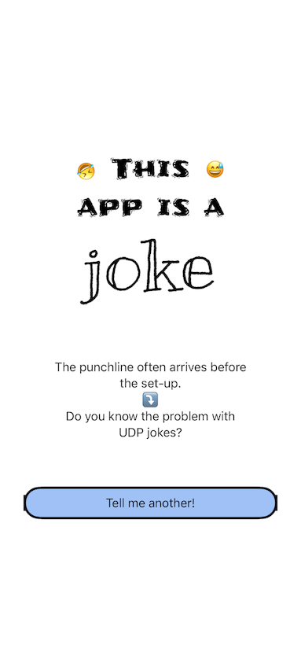
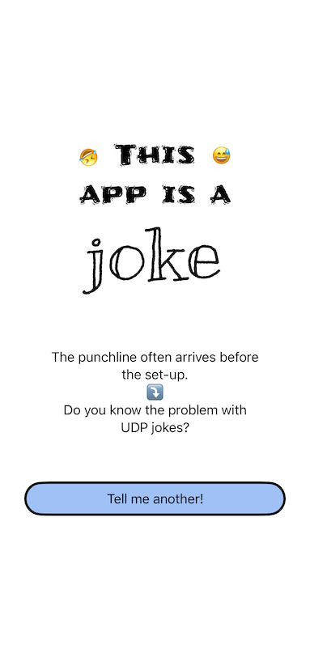
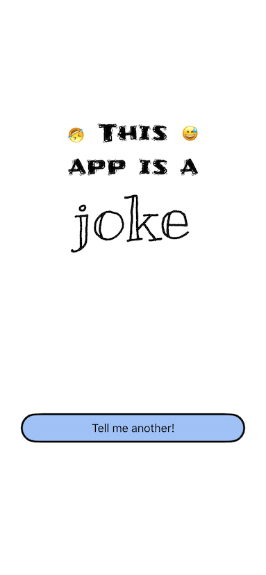
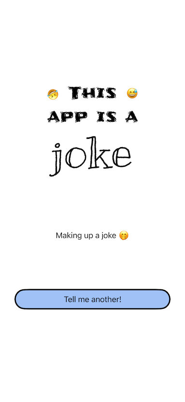
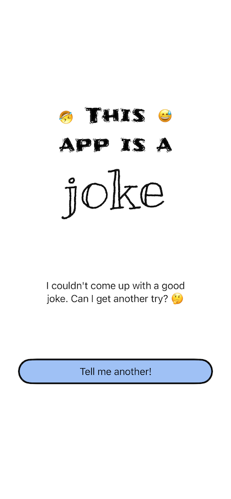
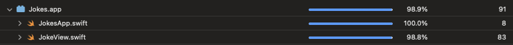
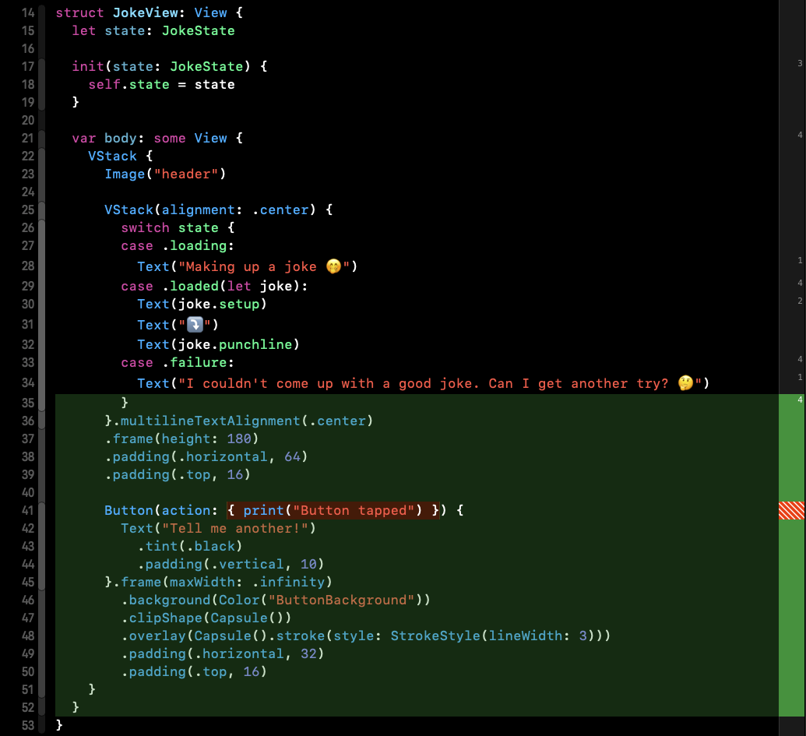

## Intro

- wiele razy no social mediach widziałem komentarze na temat testowalności (a właściwie braku testowalności) kodu napisanego w SwiftUI. Wiedziałem o istnieniu narzędzi tworzonych przez open source community i chciałem się przekonać jak to jest z tą testowalnością
- obecnie na codzień zajmuje się aplikacją która nie używa SwiftUI i chciałbym nadrobić zaległości w SwiftUI a zwłaszcza w toolingu do testów tworzonego przez community
- aby nie tworzyć długiego posta którego postanwoiłem podzielić go na conajmniej 2 części. W pierwszej części przedstawię requirementsy i zajmę się zaimplementowaniem części UI, a w drugiej części logiki biznesowej
- co użyjemy SwiftUI, async await, jeżeli chodzi o architekturę to nie będziemy się początkowo na tym skupiać ale po napisaniu testów spróbujemy zrobić refaktor i wpraowdzić jakiś prosty Redux żeby sprawdzić czy nasze testy pomogą nam podczas refaktoru
- testy mają nam pomóc i umożliwiać łatwy refaktor

## Chapter I - Requirements

Let's describe our requirements that we'll be implementing.

### Business logic

#### As a user I can see a joke
- a joke is displayed in a format
```
setup
⤵️
punchline
```
example:
```
The punchline often arrives before the set-up.
⤵️
Do you know the problem with UDP jokes?
```
- the text is aligned to center
- under the joke there is a button named "Tell me another!"
- over the text there is a header in a form of the image that is centered

#### As a user I can get a new joke
- when the button "Tell me another!" is tapped, the API request fetching a new random joke is triggered
- during the request we replace a joke with loading indication text - "Making up a joke 🤭"
- when the request succeeds we display a new joke in a place of loading indication text ("Making up a joke 🤭")
- when the request fails we replace a joke with the text - "I couldn't come up with a good joke. Can I get another try? 🤔"

### Design
(Please don't judge me design skills 😅)


### API
For API we're going to use [Official Joke API](https://github.com/15Dkatz/official_joke_api). Where the response format looks ⤵️
```
GET https://official-joke-api.appspot.com/random_joke
```
```json
{
   "type": "programming",
   "setup": "The punchline often arrives before the set-up.",
   "punchline": "Do you know the problem with UDP jokes?",
   "id": 73
}
```
## Chapter II - UI

Let's start the journey and move to the cream de la cream of that blog post! 
Będzie dużo obrazków :D

- zaczenimy od impelemtacji UI dla 3 stanów które mamy, joke, loading, error

Według zasad TDD zaczniemy od napisania testu snapshotowego. Nie będzie to ksiązkowe TDD ale będzie to najbardziej do tego podobne. Opisywałem już kiedyś jak działają testy snapshotowe (tutaj link do mojego blog posta)

- dodaje libkę SnapshotTesting do targetu testowego projektu
- piszę pierwszy test snapshotowy bez dodawania jakiejkolwiek implementacji
```swift
func test_JokeView_DisplaysJoke() {
 let joke = Joke(
   setup: "The punchline often arrives before the set-up.",
   punchline: "Do you know the problem with UDP jokes?"
 )
 let sut = JokeView(joke: joke)
 let controller = UIHostingController(rootView: sut)
 assertSnapshot(of: controller, as: .image(on: .iPhone13Pro), record: true)
}
```
- teraz dodam kod żeby projekt się budował
```swift
struct Joke {
  let setup: String
  let punchline: String
}

struct JokeView: View {
  let joke: Joke

  init(joke: Joke) {
    self.joke = joke
  }

  var body: some View {
    Text("Hello world")
  }
}
```
i odpalę wcześniej napisany snapshot test. Otrzymamy failure - oczekiwane jesteśmy w record mode i snapshot z cała biała reprezentacją ekranu iPhone 13 Pro z napisanem Hello world na środku. We are ready for our Joke View definition according to the design.

??? może obrazek tutaj ???

- Będziemy budować nasz widok przy pomocy Preview więc spróbujemy wysherować logikę z naszego testu, żeby uniknać copy-paste (anti-)pattern.

```swift
enum JokeViewPreviewProvider {

  // MARK: - Views

  static let jokeView = JokeView(state: .loaded(joke: joke))

  // MARK: - Models

  static let joke = Joke(
    setup: "The punchline often arrives before the set-up.",
    punchline: "Do you know the problem with UDP jokes?"
  )

}
```
a potem zmienimy nasz test na:
```swift
func test_JokeView_DisplaysJoke() {
 let controller = UIHostingController(rootView: JokeViewPreviewProvider.jokeView)
 assertSnapshot(of: controller, as: .image(on: .iPhone13Pro), record: true)
}
```
dzięki temu reużywamy tego samego widoku przy preview i tesście snapshotowym

więc dodajemy preview
```swift
#Preview {
  JokeViewPreviewProvider.jokeView
}
```
- kolejny krok jest prosty - zainmepemtujemy nasz ekran w stanie kiedy wyświetalmy joke
Jeżeli robiłbym to w UIKit to napisałbym test snapshotowy i sprawdzał rezultat po każdorazowej zmianie widoku ale, że SwiftUI oferuje nam live reloading - użyję previews, na końcu nagram snapshot, sprawdzę jego poprawność i zapiszę jako obrazek referencyjny.
Running the simulator and the screen verification is the very last step of my UI implementation

- Nagrywam reference image i okazuje się że zaokrąglenie się źle renderuje



Trzeba zrobić record in key window bo ... którkie wytłumaczenie. Napiszę kiedyś o tym kolejnego posta

```swift
assertSnapshot(
  of: controller,
  as: .image(drawHierarchyInKeyWindow: true, size: ViewImageConfig.iPhone13Pro.size),
  record: true
)
```



usuwamy z naszej funckji assertSnapshot argument `record: true` i nasz test powinnien być teraz zielony. Dla sprawdzenia czy test rzeczywiście coś weryfikuje możemy dokonać jakiejś zmiany w widoku np. zmienić kolor backgroundu buttona na .red i odpalić test jeszcze raz - powinniśmy dostać failure a po ponownej zmianie do wersji pierwotnej - success.

- teraz commit i jedziemy dalej! Mamy jeszcze 2 stany UI - loading i error
- zacznijmy od napisania testu. Musimy w jakiś sposób zmienić nasz model aby mieć możliwość wyświetlenia inncyh stanów
```swift
func test_JokeView_LoadingJoke() {
  let controller = UIHostingController(rootView: JokeViewPreviewProvider.jokeLoading)
  assertSnapshot(
    of: controller,
    as: .image(drawHierarchyInKeyWindow: true, size: ViewImageConfig.iPhone13Pro.size),
    record: true
  )
}
```
the code does not compile, so we are in the red stage, let's make it compile first

let's introduce the struct `JokeState` with 2 cases and let's inject it to the JokeView isntead of `Joke`
```swift
enum JokeState {
  case loading
  case loaded(joke: Joke)
}
```
```swift
struct JokeView: View {
  let state: JokeState

  init(state: JokeState) {
    self.state = state
  }

  ...
}
```
```swift
enum JokeViewPreviewProvider {

  // MARK: - Views

  static let jokeView = JokeView(state: .loaded(joke: joke))
  static let loadingView = JokeView(state: .loading)

  // MARK: - Models

  static let joke = Joke(
    setup: "The punchline often arrives before the set-up.",
    punchline: "Do you know the problem with UDP jokes?"
  )

}
```
i zmieniamy body
```swift
var body: some View {
  VStack {
    Image("header")

    VStack(alignment: .center) {
      switch state {
      case .loading:
        EmptyView()
      case .loaded(let joke):
        Text(joke.setup)
        Text("⤵️")
        Text(joke.punchline)
      }
    }.multilineTextAlignment(.center)
    .frame(height: 180)
    .padding(.horizontal, 64)
    .padding(.top, 16)

    Button(action: { print("Button tapped") }) {
      Text("Tell me another!")
        .tint(.black)
        .padding(.vertical, 10)
    }.frame(maxWidth: .infinity)
      .background(Color("ButtonBackground"))
      .clipShape(Capsule())
      .overlay(Capsule().stroke(style: StrokeStyle(lineWidth: 3)))
      .padding(.horizontal, 32)
      .padding(.top, 16)
  }
}
```

teraz test powienien się już komilować, więc sprawdźmy jaki snapshot nagramy. Kod się kompiluje i dostajemy failure - oczewkiane mamy argument record: true. Otrzymujemy snapshot bez tekstu co jest również oczekwiane ponieważ
dla stanu loading wstawiamy EmptyView



Let's replace EmptyView() with the text according to the criteria and trigger the snapshot to re-record again.

dodajemy preview i robimy zmiany
```swift
#Preview {
  JokeViewPreviewProvider.loadingView
}
```



snapshot wyglada na poprawny więc commitujemy go jako obrazek referencyjny i wyrzucamy argument `record: true` z testu.

Powtórzmy ten sam schemat dla stanu failure. Piszemy test
```swift
func test_JokeView_LoadingJokeFailure() {
  let controller = UIHostingController(rootView: JokeViewPreviewProvider.jokeLoadingFailure)
  assertSnapshot(
    of: controller,
    as: .image(drawHierarchyInKeyWindow: true, size: ViewImageConfig.iPhone13Pro.size),
    record: true
  )
}
```
dodajemy case
```swift
enum JokeState {
  case loading
  case loaded(joke: Joke)
  case failure
}
```
robimy zmiany w preview providerze
```swift
enum JokeViewPreviewProvider {

  // MARK: - Views

  static let jokeView = JokeView(state: .loaded(joke: joke))
  static let loadingView = JokeView(state: .loading)
  static let jokeLoadingFailure = JokeView(state: .failure)

  // MARK: - Models

  static let joke = Joke(
    setup: "The punchline often arrives before the set-up.",
    punchline: "Do you know the problem with UDP jokes?"
  )

}
```
Obsługujemu case w JokeView dodająca do switcha EmptyView
```swift
var body: some View {
  VStack {
    Image("header")

    VStack(alignment: .center) {
      switch state {
      case .loading:
        Text("Making up a joke 🤭")
      case .loaded(let joke):
        Text(joke.setup)
        Text("⤵️")
        Text(joke.punchline)
      case .failure:
        EmptyView()
      }
    }.multilineTextAlignment(.center)
    .frame(height: 180)
    .padding(.horizontal, 64)
    .padding(.top, 16)

    Button(action: { print("Button tapped") }) {
      Text("Tell me another!")
        .tint(.black)
        .padding(.vertical, 10)
    }.frame(maxWidth: .infinity)
      .background(Color("ButtonBackground"))
      .clipShape(Capsule())
      .overlay(Capsule().stroke(style: StrokeStyle(lineWidth: 3)))
      .padding(.horizontal, 32)
      .padding(.top, 16)
  }
}
```
Puszczamy test i nagrywamy snapshot. Snapshot w pierwszej iteracji wygląda dokłądnie tak jak snapshot w pierwszej iteracji dla loading state.

Dodajemy preview

```swift
#Preview {
  JokeViewPreviewProvider.jokeLoadingFailure
}
```

Teraz dodajemy implementację żeby obsłużyć ten stan w body widoku

```swift
var body: some View {
  VStack {
    Image("header")

    VStack(alignment: .center) {
      switch state {
      case .loading:
        Text("Making up a joke 🤭")
      case .loaded(let joke):
        Text(joke.setup)
        Text("⤵️")
        Text(joke.punchline)
      case .failure:
        Text("I couldn't come up with a good joke. Can I get another try? 🤔")
      }
    }.multilineTextAlignment(.center)
    .frame(height: 180)
    .padding(.horizontal, 64)
    .padding(.top, 16)

    Button(action: { print("Button tapped") }) {
      Text("Tell me another!")
        .tint(.black)
        .padding(.vertical, 10)
    }.frame(maxWidth: .infinity)
      .background(Color("ButtonBackground"))
      .clipShape(Capsule())
      .overlay(Capsule().stroke(style: StrokeStyle(lineWidth: 3)))
      .padding(.horizontal, 32)
      .padding(.top, 16)
  }
}
```
po czym odpalam test jeszcze raz, jeżeli snapshot się zgadza, zostawiam snapshot jako referencyjny i usuwam `record: true` z testu. 



Po pownowyn uruchomieniu testów powinniśmy mieć powonieśmy mieć 3 zielone checki

## Summary

In the end our code coverage for JokeView is 98.8%


the untested code is the button action.


We've covered all UI from the requirements. We have 3 snapshot tests that verify the correctness of the UI. The next step will be even more interesting, we're going to try to implement business logic in TDD!

---

Thanks for reading. 📖

I hope you found it useful!

If you enjoy the topic don't forget to follow me on one of my social media or via RSS feed to keep up to speed. 🚀
