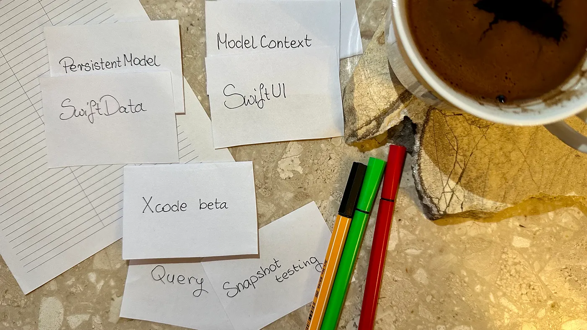

We’re just after this year’s WWDC where we had a chance to witness the unveiling of a new persistence framework called SwiftData. Naturally, I couldn’t resist delving deeper into it. One particular topic that caught my attention was the observation of local storage using Query and its testability.



### SwiftData

> SwiftData makes it easy to persist data using declarative code. You can query and filter data using regular Swift code. And it’s designed to integrate seamlessly with SwiftUI.
>
> Apple docs

Starting using SwiftData in your app is incredibly straightforward.

Step one: Create a persistable model. To do it use a new Model macro that under the hood converts the class into a model manageable by SwiftData.

```swift
@Model
class Flashcard {
  let front: String
  let back: String
}
```

👀 Hint: To reveal what’s hidden under the macro use Xcode built-in option to expand the macro.


The macro annotation is the only modification that is actually needed to make your model persistable! 🤯

Step two: Define a container and propagate model context to SwiftUI views using `.modelContainer(for: any PersistentModel)` view modifier.

A Model Container is an object that, based on the given schema and configuration, manages how your app data is stored in a database.

```swift
WindowGroup {
  FlashcardSetsView()
}.modelContainer(
  for: [Flashcard.self]
)
```

That makes your app ready to work with SwiftData.

Alongside SwiftData, Apple has rolled out an interesting Query property wrapper that lets you to observe your local cache state. By using it, all updates of your entities (insert / update / delete) are reflected in SwiftUI views.

Since I believe that learning happens best through hands-on examples, let’s try to apply new knowledge and build a foundation for a flashcard app.

### Query property wrapper

Let’s assume that we have to build a flashcard app. Our main goal is checking the usage of Query property wrapper and it’s testability, so to simplify let’s focus only on the screen displaying flashcard sets list.

⚠️ In the blog post I’ll be using a shorter version of the code. In the end there is a link to the Github repository where you can check the working version presented here.

First, let’s define our persistable models. To achieve that we can use the Model macro.

```swift
@Model
class Flashcard {
  let front: String
  let back: String
}

@Model
class FlashcardsSet {
  let name: String
  var flashcards: [Flashcard] = []
}
```

We defined two models. The first represents a single flashcard, the second groups flashcards into sets. A flashcard set may have many flashcards. The relation between the entities is handled automatically by SwiftData after defining a `flashcards` property in the `FlashcardSet` model.

An implementation of a simple list to display them shouldn’t be a problem! 💪🏻

```swift
struct FlashcardSetsView: View {
  let flashcardSets: [FlashcardsSet]

  var body: some View {
    List {
      Section {
        ForEach(flashcardSets) { flashcardsSet in
          HStack {
            Text(flashcardsSet.name)
            Spacer()
            Text("Cards: \(flashcardsSet.flashcards.count)")
          }
        }
      }
    }
    .navigationTitle("Flashcard Sets")
  }
}
```

The result is a view with list of flashcard sets ⤵️


Now let’s modify our views to observe local cache updates by using the Query property wrapper.

```swift
struct FlashcardSetsView: View {
  @Query(sort: \.name, order: .forward) var flashcardSets: [FlashcardsSet] // 1

  var body: some View {
    List {
      Section {
        ForEach(flashcardSets) { flashcardsSet in
          HStack {
            Text(flashcardsSet.name)
            Spacer()
            Text("Cards: \(flashcardsSet.flashcards.count)")
          }
        }
      }
    }
    .navigationTitle("Flashcard Sets")
  }
}
```

*// 1 — property wrapper that loads, filters, sorts and observes changes of your local cache. In the given example we observe cache updates on `FlashcardsSet` entity and sort results alphabetically using name property.*

The last thing is a container definition

```swift
@main
struct FlashcardsApp: App {
  var body: some Scene {
    WindowGroup {
      NavigationStack {
        FlashcardSetsView()
      }
    }.modelContainer(for: [FlashcardsSet.self, Flashcard.self]) // 1
  }
}
```

*// 1 — manages an app’s schema and model storage configuration. We register our container together with the `FlashcardsSet` and `Flashcard` models that we’d like to persist.*

Everything is setup and your persistence layer is now fully integrated with the view layer! It wasn’t hard right? 🥱

To demonstrate that the integration works let’s add one more section that generates `FlashcardsSet` when a button is tapped.

```swift
struct FlashcardSetsView: View {
  @Query(sort: \.name, order: .forward) var flashcardSets: [FlashcardsSet]
  @Environment(\.modelContext) private var context // 1

  var body: some View {
    List {
      Section {
        Button("Generate random set") {
          context.insert(Random.flashcardsSet()) // 2
        }
      }
      Section {
        ForEach(flashcardSets) { flashcardsSet in
          HStack {
            Text(flashcardsSet.name)
            Spacer()
            Text("Cards: \(flashcardsSet.flashcards.count)")
          }
        }
      }
    }
    .navigationTitle("Flashcard Sets")
  }
}
```

*// 1 — model context that is propagated to views after the model container declaration using `.modelContainer(for: PersistentModel.Type)`*

*// 2 — new flashcards set generation using factory function and inserting it into the context. After the insert you don’t have to call `save()` SwiftData handles it for you.*

As a result we get an additional section with the button triggering generation of a new random item on the list ⤵️


Let’s move on to the cherry 🍒 on top, which is testing the Query property wrapper.

### Testing

Based on my previous experience with SwiftUI I know that it’s impossible to fully test a View. Hence the question: Can I test SwiftData and the usage of Query property wrapper?

The answer is — Yes, indeed! 🤩

The snapshot testing library comes to the rescue 🙏🏻 https://github.com/pointfreeco/swift-snapshot-testing

Snapshot testing it’s an approach involving capturing elements of a user interface (UI) and storing them as reference images. During each test run, a new snapshot of the given UI element is taken and compared against the stored reference image. This technique allows developers to quickly identify unintended visual changes that might be caused by broken layout or bugs inside business logic.

Let’s begin by writing our first test.

```swift
@MainActor func testDisplayingFourInsertedSets() { // 1
  let configuration = ModelConfiguration(inMemory: true) // 2
  let inMemoryContainer = try! ModelContainer(
    for: [Flashcard.self, FlashcardsSet.self], 
    configuration
  ) // 3
  let context = inMemoryContainer.mainContext // 4

  let sut = NavigationStack { // 5
    FlashcardSetsView()
      .modelContainer(inMemoryContainer) // 6
  }

  let quantumMechanic100 = FlashcardsSet(name: "Quantum Mechanic", numberOfFlashcards: 100)
  let nanoscience30 = FlashcardsSet(name: "Nanoscience", numberOfFlashcards: 30)
  let nuclearPhysics70 = FlashcardsSet(name: "Nuclear Physics", numberOfFlashcards: 70)
  let nanotechnology5 = FlashcardsSet(name: "Nanotechnology", numberOfFlashcards: 5)

  [quantumMechanic100, nanoscience30, nuclearPhysics70, nanotechnology5].forEach { flashcardsSet in
    context.insert(flashcardsSet) // 7
  }

  let viewController = UIHostingController(rootView: sut) // 8
  assertSnapshot(
    matching: viewController, 
    as: .image(on: .iPhone13Pro), 
    named: "four_flashcard_sets_inserted"
  ) // 9
}
```

*// 1 — The `@MainActor` attribute guarantees that the function will be executed on the main thread. The function has to be marked with `@MainActor`, because inside we use the container’s `mainContext` property that is marked with `@MainActor`. Without the mark the code doesn’t compile, because you are attempting to access a main actor-isolated property from a non-isolated context, and Swift compiler detects that.*

*// 2 — by default data are stored on a disk. To simplify tests and avoid shared fixture problem we use in-memory storage that is cleaned after each test.*

*// 3 — manages an app’s schema and model storage configuration. We register our container together with the `FlashcardsSet` and `Flashcard` models that we’d like to persist. We pass the configuration as an argument specifying us that the container has to store data in-memory.*

*// 4 — context that lets us seed our database.*

*// 5 — the flashcard sets view has defined navigation title requiring navigation view to be displayed and rendered on a snapshot.*

*// 6 — propagation of in-memory container to the view.*

*// 7 — seeding in-memory database with test data.*

*// 8 — wrapping SwiftUI View in `UIHostingController` to use Snapshotting strategy designed for UIViewController. It’s possible to use a strategy designed for SwiftUI view, but the UIKit one renders navigation title better.*

*// 9 — snapshot test taking view controller to snapshot, snapshotting strategy (in our case it’s an image rendered using iPhone 13 Pro UI specifications like size, traits and safe area) and name describing a snapshot.*

We run the test and get failure ❌

It’s expected, because the first phase of the snapshot test is recording a reference image ⤵️


In the reference image we see that four objects inserted to a local cache are displayed, so we are successful 🥳

After the test re-run you should get ✅

Now, let’s explore another scenario to double-check updates coming from the cache. In this test we’re going to delete one of the previously inserted objects and expect the snapshot to not have the deleted object.

```swift
@MainActor func testDisplayingFourInsertedSetsAndRemovingOne() { // 1

  ... // The previous version of the test collapsed

  context.delete(nuclearPhysics70) // 2
  try! context.save() // 3

  assertSnapshot(
    matching: viewController,
    as: .image(on: .iPhone13Pro),
    named: "four_flashcard_sets_inserted_one_removed"
  ) // 4
}
```
*// 1 — we update the previously written test description to better describe what behaviour we test.*

*// 2 — deletion of previously inserted object.*

*// 3 — to have deletion changes displayed on a snapshot we have to save context manually.*

*// 4 — definition of the next snapshot in the scope of the same test.*

We run the test and voilà 🎉

We get the next reference image without a deleted object ⤵️


The integration of SwiftData and SwiftUI has been successfully tested 🎉

### Summary

We’ve been eagerly awaiting a modern successor to CoreData, and finally, we have a promising pretender on the horizon — SwiftData.

It’s fantastic to see Apple’s ongoing dedication to the advancement of SwiftUI and the introduction of new frameworks complementing it.

Nevertheless, it would be beneficial to see further advancements in the development of tools assisting developers in their day-to-day work, such as automated testing tools (especially unit testing), to keep pace with the rapid evolution of SwiftUI.

### Useful links
- Github repo with the code — https://github.com/Zaprogramiacz/SwiftDataQuery. Running it requires Xcode 15 beta ⚠️
- SwiftData docs — https://developer.apple.com/xcode/swiftdata/
- Meet SwiftData — https://developer.apple.com/videos/play/wwdc2023/10187/


