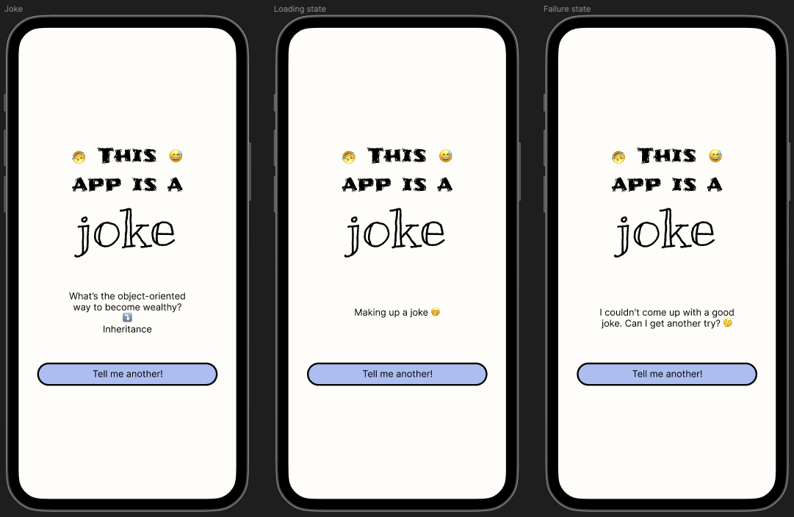
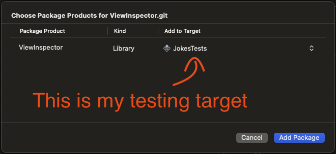
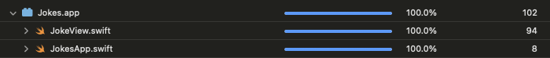

## Recap

Hello everyone and welcome to the next chapter of the series about SwiftUI code automated testing!

In the previous post we
- defined acceptance criteria for the Joke app that we're implementing
- we covered by snapshot tests all UI cases mentioned in the acceptance critieria

That's what the app looks like ⤵️



Here's the link to the previous blog post ⤵️ (Worth reading before this one)

[Testing SwiftUI Code - The beginning (UI)](https://www.mobiledevdiary.com/posts/testing-swiftui-code-the-beginning/)

## Chapter III - Triggering API request

### Intro

The goal of that chapter is to start implementing business logic described in the acceptanca critieria [here](https://www.mobiledevdiary.com/posts/testing-swiftui-code-the-beginning/#as-a-user-i-can-get-a-new-joke).

We're going to focus on the point ⤵️
> As a user I can get a new joke
> - when you tap the button “Tell me another!”, the API request fetching a new random joke is triggered.

We'll be adding unit tests based on the acceptance criteria and the plan is to avoid mocking wherever it's possible. In theory it's simple, but in reallity it's pretty complex and it requires introducing a few tricks.

When implementing we'll keep in mind good unit tests attributes ⤵️
- fast 🏎️ - a project usually consists of hundreds / thousands unit tests, so they have to be really quick to give feedback fast to a developer. If tests are slow, no one wants to run them and the cost of maintanace and execution might be overwhelming.
- deterministic 🎯 - for the given input there is always the same output, no matter the environment, time or order of execution
- isolated 🚪 - avoid using shared states (like Singletons) that can impact a test result

### Test draft, first challange

As a reminder, here is the request structure ⤵️

```
GET https://official-joke-api.appspot.com/random_joke
```
```json
{
   "type": "programming",
   "setup": "The punchline often arrives before the set-up.",
   "punchline": "Do you know the problem with UDP jokes?",
   "id": 73
}
```

First things first! Let's focus on checking if the correct endpoint is called. We start with the basic test: when you tap the button “Tell me another!”, the API request is called. Then we build on the top of it.

Let's create the `JokeViewTests` file and class and then configure the sut (system under test - `JokeView`) inside ⤵️

```swift
class JokeViewTests: XCTestCase {

  func test_whenTappingOnTheButton_ItTriggersRequest() {
    let sut = JokeView(state: .loaded(joke: .udp))
  }

}

private extension Joke {

  static var udp: Joke {
    .init(
      setup: "The punchline often arrives before the set-up.",
      punchline: "Do you know the problem with UDP jokes?"
    )
  }

}
```

We've hardly started and already faced a first challnage on our way! - How to execute button action in the test? 🤔

Spoiler: You can try to find APIs built into standard frameworks, but you won't succeed 😢

Luckily 🍀, we have a great community that comes to the rescue! ⤵️

### Triggering the button action using ViewInspector

There is a way of triggering the button action using [ViewInspector](https://github.com/nalexn/ViewInspector) library.

> ViewInspector is a library for unit testing SwiftUI views. It allows for traversing a view hierarchy at runtime providing direct access to the underlying View structs.

It comes with SPM support, so let's add it to our project. Make sure to add the package to the testing target ‼️



To check whether the ViewInspector works, we'll now update the test. Let's assume we want to inject the closure `() -> Void` to the `JokeView` and then trigger it after the "Tell me another!" button is tapped. That test confirms that ViewInspector is able to trigger the button action. Let's start with updating the test ⤵️

```swift
func test_whenTappingOnTheButton_ItTriggersRequest() throws {
  var isActionTriggered = false
  let sut = JokeView(state: .loaded(joke: .udp)) {
    isActionTriggered = true
  }
  try sut.inspect().find(button: "Tell me another!").tap() // 1

  XCTAssertTrue(isActionTriggered)
}
```
// 1 - To find the exact button we use the function `find` from the ViewInspector that looks for the button with given text in the View structure.
```swift
func find(text: String, locale: Locale = .testsDefault) throws -> InspectableView<ViewType.Text>
```

It should not compile, so we are in the red stage 🔴. Next step - add missing implementation ⤵️

```swift
struct JokeView: View {
  ...
  private let buttonAction: @escaping () -> Void

  init(state: JokeState, buttonAction: @escaping () -> Void) {
    ...
    self.buttonAction = buttonAction
  }

  var body: some View {
      Button(action: { buttonAction() }) {
        Text("Tell me another!")
        ...
      }
      ...
    }
  }
}
```

Now we run the test and check if it's 🟢 ⏳ ...

After the moment the test should pass ✅, so we get confirmation that `ViewInspector` library fits our needs 🤗

### API request execution

We can revert the change with `buttonAction` now - remove `() -> Void` closure passed to the `JokeView`, update test to compile and go back to our flow to test.

To communicate with API we use native `URLSession` more precisely - the function that uses async / await ⤵️
```swift
public func data(for request: URLRequest, delegate: (any URLSessionTaskDelegate)? = nil) async throws -> (Data, URLResponse)
```

It was said that good unit tests should be fast, deterministic and isolated, so they cannot be based on the real API. That means we cannot use the real API in the test, so we need to mock it somehow.

Inside the test we need the request executor closure that will have the same signature like `data` function from `URLSession` ⤵️

```swift
func test_whenTappingOnTheButton_ItTriggersRequest() throws {
  var requestExecutorInvokedWithRequest: URLRequest? // 2
  let sut = JokeView(state: .loaded(joke: .udp)) { request, _ in // 1
    requestExecutorInvokedWithRequest = request // 2

    return (Data(), URLResponse()) // 3
  }

  try sut.inspect().find(button: "Tell me another!").tap()

  XCTAssertEqual(
    requestExecutorInvokedWithRequest?.url, 
    .init(URL(string: "https://official-joke-api.appspot.com/random_joke")!)
  ) // 4
}
```
- // 1 - `JokeView` takes `(URLRequest, (any URLSessionTaskDelegate)?) async throws -> (Data, URLResponse)` closure as an argument.
- // 2 - When the closure is called we can intercept the request, so that we can check the URL called.
- // 3 - To satisfy the compiler we return stubbed data (We'll be covering that part later).
- // 4 - We assert the URL intercepted from the request executor.

When we run the test we find out it does not compile. It's expected, because we assume `JokeView` takes additional argument. Nevertheless, we are in the red stage 🔴, so we can start updating the implementation ⤵️

```swift
struct JokeView: View {
  private let requestExecutor: (URLRequest, (any URLSessionTaskDelegate)?) async throws -> (Data, URLResponse)
  @State var state: JokeState

  init(
    state: JokeState,
    requestExecutor: @escaping (URLRequest, (any URLSessionTaskDelegate)?) async throws -> (Data, URLResponse) = URLSession.shared.data
  ) {
    self.state = state
    self.requestExecutor = requestExecutor
  }

  ...

}
```

After this change the code compiles again, but the test fails. To make it green 🟢 we need to add the code requesting a new joke ⤵️

```swift
...

var body: some View {
  VStack {
    ...

    Button(action: { fetchNewJoke() })

    ...
  }
}

func fetchNewJoke() {
  let url = URL(
    string: "https://official-joke-api.appspot.com/random_joke"
  ).unsafelyUnwrapped
  let request = URLRequest(url: url)
  Task { // 1
    try! await requestExecutor(request, nil)
  }
}

...
```
- // 1 - RequestExecutor closure is `async`, so it has to be wrapped in `Task`.

We run the test again: did it pass? Yes and no. By wrapping the code inside the `Task` we introduced the asynchronicity to the production code that makes the test not work in a deterministic way - it randomly fails and passes.

### The problem of asynchronism in the test

To resolve the problem of the code part running asynchornously, we use `XCTestExpectation` inside the test ⤵️

```swift
func test_whenTappingOnTheButton_ItTriggersRequest() throws {
  var requestExecutorInvokedWithRequest: URLRequest?
  let expectation = XCTestExpectation(description: "Wait for request being executed") // 1
  let sut = JokeView(state: .loaded(joke: .udp)) { request, _ in
    requestExecutorInvokedWithRequest = request
    expectation.fulfill() // 3

    return (Data(), URLResponse())
  }

  try sut.inspect().find(button: "Tell me another!").tap()

  wait(for: [expectation], timeout: 0.1) // 2

  XCTAssertEqual(
    requestExecutorInvokedWithRequest?.url, 
    .init(URL(string: "https://official-joke-api.appspot.com/random_joke")!)
  )
}
```
- // 1 - Definition of `XCTestExpectation`.
- // 2 - Waiter that waits in that line for the expectation to be fulfilled and continue execution.
- // 3 - `fulfill` method called in a asynchronous context to make sure the async code it's finished before assertion.

We run the test again, and again (there is an option in Xcode to run the test multiple times e.g 100 times) just to be sure it works in a deterministic way. Spoiler - it should be all time green now ✅

All that is left now is the refactoring. This `requestExecutor` closure in the production code does not look cool to me. My suggestion is creating `URLSessionProtocol` instead ⤵️

```swift
protocol URLSessionProtocol {
  func data(
    for request: URLRequest,
    delegate: (any URLSessionTaskDelegate)?
  ) async throws -> (Data, URLResponse)
}

extension URLSession: URLSessionProtocol {}
```
Later, we can inject it into `JokeView` instead of `requestExecutor` closure and then use it ⤵️
```swift
struct JokeView: View {
  ...
  private let urlSession: URLSessionProtocol

  init(
    ...
    urlSession: URLSessionProtocol = URLSession.shared
  ) {
    ...
    self.urlSession = urlSession
  }

  var body: some View {
    ...
  }

  func fetchNewJoke() {
    let url = URL(string: "https://official-joke-api.appspot.com/random_joke").unsafelyUnwrapped
    let request = URLRequest(url: url)
    Task {
      try! await urlSession.data(for: request, delegate: nil)
    }
  }

}
```
The test also requires some changes. First `URLSessionSpy` definition ⤵️
```swift
class URLSessionSpy: URLSessionProtocol {

  var dataForRequestExpectation: XCTestExpectation?
  private(set) var dataInvokedWithRequest: [URLRequest] = []

  func data(for request: URLRequest, delegate: (any URLSessionTaskDelegate)?) async throws -> (Data, URLResponse) {
    dataInvokedWithRequest.append(request)
    dataForRequestExpectation?.fulfill()

    return (Data(), URLResponse())
  }

}
```
and then changes in the test ⤵️
```swift
func test_whenTappingOnTheButton_ItTriggersRequest() throws {
  let expectation = XCTestExpectation(description: "Wait for request being executed") // 1
  let urlSessionSpy = URLSessionSpy()
  urlSessionSpy.dataForRequestExpectation = expectation // 2
  let sut = JokeView(state: .loaded(joke: .udp), urlSession: urlSessionSpy)

  try sut.inspect().find(button: "Tell me another!").tap()

  wait(for: [expectation], timeout: 0.1)

  XCTAssertEqual(
    urlSessionSpy.dataInvokedWithRequest.map(\.url?.absoluteString),
    ["https://official-joke-api.appspot.com/random_joke"]
  )
}
```
- // 1 - We still need `XCTestExpectation` to be sure the assertion is always called after the request is executed.
- // 2 - `URLSessionSpy` has API for setting the `XCTestExpectation` that is fullfilled when data for request method is being called.

After the refactor we verify the implementation by running all tests to ensure tests are green 🟢

## Summary

Today we made a small step towards having the all requirements implemented in TDD. In theory it's only one short test, but we discovered how to trigger button action based on its title using ViewInspector. I dare say we busted (again 😅) the myth about SwiftUI code being not testable.

### Code coverage

The final outcome: the code coverage for Jokes.app is 100%


A few extra final notes on the code coverage ⤵️

Code coverage it's a value that does not guarantee your code works 100% correctly, and it shouldn't be chased or set as any goal. Code coverage serves more like a helper to a developer providing rough information about percentage of code lines triggered in a test suite. Additionally, it can show you not tested pieces of code when you're not coding in TDD or point you to old not used code. Remember that this pure statistic value looks good on presentations and charts, but it won't defend you when you design tests in a bad maner! - That's why I decided to start the series where we're going to workout the best to handle testing SwiftUI code. 💯

The app is not complete, so stay tuned as there's more to come! I'm gonna be sharing even more tips and tricks 📚

## Resources

- Github repository with the code: https://github.com/Zaprogramiacz/JokesApp/tree/TDD-with-SwiftUI-Triggering-API-request
- ViewInspector: https://github.com/nalexn/ViewInspector
- Joke API: https://github.com/15Dkatz/official_joke_api

---

Thanks for reading. 📖

I hope you found it useful!

If you enjoy the topic don't forget to follow me on one of my social media - [LinkedIn](https://www.linkedin.com/in/maciej-gomolka/), [X](https://twitter.com/gomolka_maciej) or via [RSS](https://www.mobiledevdiary.com/index.xml) feed to keep up to speed. 🚀
