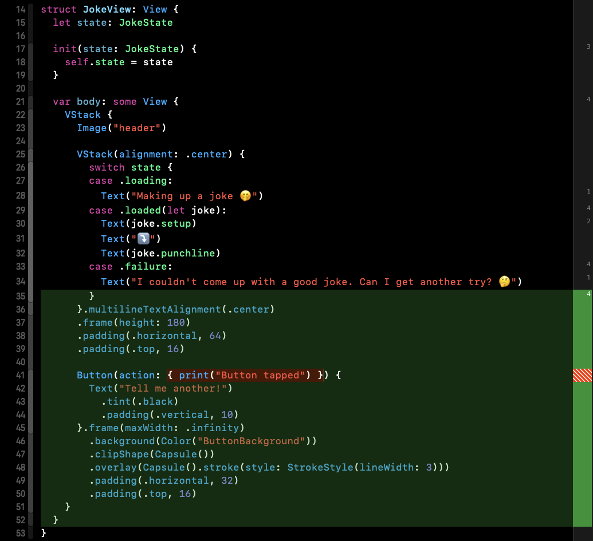

## Intro

Hello everyone and welcome to my first (ever) blog series!

Today I'm going to begin experimenting with SwiftUI. The mission is to build a small application and having it fully tested 💯. I decided to go for that quest to broaden my knowledge around SwiftUI and verify the rumors that it cannot be tested.

To keep it relatively readable I decided to split it up and we're going to see how many parts we end up with.

What I planned so far:
- defining the requirements
- writing tests and implementation of UI
- writing tests and implementation (in TDD) of business logic
- ... and something more, maybe try to re-shape the app to follow Redux architecture 🤔

Let's get this journey started and move to the crème de la crème of the blog post! 

## Chapter I - Requirements

Our goal will be to build a very simple app that displays jokes fetched from the API.

We're going to start from the very beginning - describing requirements that we'll be implemented.

### Business logic

#### As a user I can see a joke
- a joke is displayed in the following format:
```
setup
⤵️
punchline
```
example:
```
The punchline often arrives before the set-up.
⤵️
Do you know the problem with UDP jokes?
```
- the text is aligned to center
- under the joke there is a button named "Tell me another!"
- over the text there is a header in a form of the image that is centered

#### As a user I can get a new joke
- when you tap the button "Tell me another!", the API request fetching a new random joke is triggered
- during the request a joke is replaced with loading indication text - "Making up a joke 🤭"
- when the request is successful a new joke in a place of loading indication text is displayed ("Making up a joke 🤭")
- when the request fails a joke is replaced with the following text - "I couldn't come up with a good joke. Can I get another try? 🤔"

### Design
(Please don't judge me design skills 😅) 


As we already agreed that I'm not an expert in desing, we won't be focusing on making it pixel perfect. We want to have all the elements look the same like on the design, but spacing can be a bit different, and we're ok with it.

### API
For API we're going to use [Official Joke API](https://github.com/15Dkatz/official_joke_api). Where the response format looks ⤵️
```
GET https://official-joke-api.appspot.com/random_joke
```
```json
{
   "type": "programming",
   "setup": "The punchline often arrives before the set-up.",
   "punchline": "Do you know the problem with UDP jokes?",
   "id": 73
}
```
## Chapter II - UI

In that chapter we're going to make snapshots of our views using the SnapshotTesting (https://github.com/pointfreeco/swift-snapshot-testing) library.

Based on our requirements we can clearly see that UI has three states: joke (when a joke is displayed), loading and error. We'll be implemeting each of them one by one starting from the snapshot tests, providing the implementation and verifying it by tests (It's the flow that I consider close to TDD). 

If you don't know how snapshot tests work I suggest reviewing the library docs https://github.com/pointfreeco/swift-snapshot-testing or in one of my blog posts ➡️ ["Testing" section](https://www.mobiledevdiary.com/posts/testing-swiftdata-and-the-query-property-wrapper-through-an-example/#testing).

Let's start with the first snapshot test covering state when a joke is displayed ⤵️

```swift
func test_JokeView_DisplaysJoke() {
 let joke = Joke(
   setup: "The punchline often arrives before the set-up.",
   punchline: "Do you know the problem with UDP jokes?"
 )
 let sut = JokeView(joke: joke)
 let controller = UIHostingController(rootView: sut)
 assertSnapshot(of: controller, as: .image(on: .iPhone13Pro), record: true)
}
```

After adding it, the project doesn't compile - it's expected, because we still haven't defined a few components yet. It's the next step ⤵️

```swift
struct Joke {
  let setup: String
  let punchline: String
}

struct JokeView: View {
  let joke: Joke

  init(joke: Joke) {
    self.joke = joke
  }

  var body: some View {
    Text("Hello world")
  }
}
```
Now the code compiles and we can run the tests. As a result we should get failure (we're in the record mode) and the reference image with "Hello world" text in the center of the white screen. It's a good first step towards the real implementation.


One of the features introduced together with SwiftUI are previews offering us live reloading when developing views.

In the UIKit I'd double check the reference snapshot after updating the view not to waste time on running simulator all over again, but here we can use previews.

To avoid copy-paste anti-pattern, we'll extract the view setup from the snapshot tests to the shared component ⤵️

```swift
enum JokeViewPreviewProvider {

  // MARK: - Views

  static let jokeView = JokeView(state: .loaded(joke: joke))

  // MARK: - Models

  static let joke = Joke(
    setup: "The punchline often arrives before the set-up.",
    punchline: "Do you know the problem with UDP jokes?"
  )

}
```

after extraction we refactor the test to the form ⤵️

```swift
func test_JokeView_DisplaysJoke() {
 let controller = UIHostingController(rootView: JokeViewPreviewProvider.jokeView)
 assertSnapshot(of: controller, as: .image(on: .iPhone13Pro), record: true)
}
```

Before starting real UI implementation we can setup the preview ⤵️

```swift
#Preview {
  JokeViewPreviewProvider.jokeView
}
```

and finally focus on the view implementation.

```swift
struct JokeView: View {
  let joke: Joke

  init(joke: Joke) {
    self.joke = joke
  }

  var body: some View {
    VStack {
      Image("header")

      VStack(alignment: .center) {
        Text(joke.setup)
        Text("⤵️")
        Text(joke.punchline)
      }.multilineTextAlignment(.center)
      .frame(height: 180)
      .padding(.horizontal, 64)
      .padding(.top, 16)

      Button(action: { print("Button tapped") }) {
        Text("Tell me another!")
          .tint(.black)
          .padding(.vertical, 10)
      }.frame(maxWidth: .infinity)
        .background(Color("ButtonBackground"))
        .clipShape(Capsule())
        .overlay(Capsule().stroke(style: StrokeStyle(lineWidth: 3)))
        .padding(.horizontal, 32)
        .padding(.top, 16)
    }
  }
}
```

When it's ready we can re-record the reference image and check if the view renders correctly.

Having a closer look at the reference image you can notice that something is wrong with the corners of the button 🤔


According to the snapshoting library documentation some components such as `UIPickerView`, `UIAppearance`, `UIVisualEffect` require to be added to the key window to render correctly. If you don't do this your snapshot won't look perfect (like the one above ⬆️).

As described above, we have to use the snapshotting strategy that renders snapshot in a key window ⤵️

```swift
assertSnapshot(
  of: controller,
  as: .image(drawHierarchyInKeyWindow: true, size: ViewImageConfig.iPhone13Pro.size),
  record: true
)
```

When we check the reference image now it displays correctly ⤵️


and if everything is perfect 👌🏻, remove `record: true` from the `assertSnapshot` function, re-run the tests, and check the result ✅

To review if test works correctly, make any change in the view e.g change the color of the button background to `.red` and run the test. It should fail ❌. Revert the failing changes to make it green again, commit and let's move on 👏🏻

The next state that has to be handled is loading. Just like before, start by wrting a test ⤵️

```swift
func test_JokeView_LoadingJoke() {
  let controller = UIHostingController(rootView: JokeViewPreviewProvider.jokeLoading)
  assertSnapshot(
    of: controller,
    as: .image(drawHierarchyInKeyWindow: true, size: ViewImageConfig.iPhone13Pro.size),
    record: true
  )
}
```

The code does not compile, so we are in the red stage, so let's make it compile first.

First, introduce the struct `JokeState` with two cases and inject it to the `JokeView` instead of `Joke` ⤵️

```swift
enum JokeState {
  case loading
  case loaded(joke: Joke)
}
```

```swift
struct JokeView: View {
  let state: JokeState

  init(state: JokeState) {
    self.state = state
  }

  ...
}
```

then, define loading view in preview providers ⤵️

```swift
enum JokeViewPreviewProvider {

  // MARK: - Views

  static let jokeView = JokeView(state: .loaded(joke: joke))
  static let loadingView = JokeView(state: .loading)

  // MARK: - Models

  static let joke = Joke(
    setup: "The punchline often arrives before the set-up.",
    punchline: "Do you know the problem with UDP jokes?"
  )

}
```

and handle new state in the view's body, by inserting `EmptyView` there ⤵️

```swift
var body: some View {
  VStack {
    Image("header")

    VStack(alignment: .center) {
      switch state {
      case .loading:
        EmptyView()
      case .loaded(let joke):
        Text(joke.setup)
        Text("⤵️")
        Text(joke.punchline)
      }
    }.multilineTextAlignment(.center)
    .frame(height: 180)
    .padding(.horizontal, 64)
    .padding(.top, 16)

    Button(action: { print("Button tapped") }) {
      Text("Tell me another!")
        .tint(.black)
        .padding(.vertical, 10)
    }.frame(maxWidth: .infinity)
      .background(Color("ButtonBackground"))
      .clipShape(Capsule())
      .overlay(Capsule().stroke(style: StrokeStyle(lineWidth: 3)))
      .padding(.horizontal, 32)
      .padding(.top, 16)
  }
}
```

We reached the stage where the test compiles, so we can now run the test. The output is expected - failure ❌, because the record mode is turned on. The recorded reference image doesn't have any text what's expected, because loading state is modeled by `EmptyView`.


If the test already compiles, we can move on to add the next preview ⤵️

```swift
#Preview {
  JokeViewPreviewProvider.loadingView
}
```

Now we can implement the loading state handling according to the requirements and trigger the test to re-record the reference image ⤵️

```swift
var body: some View {
  VStack {
    Image("header")

    VStack(alignment: .center) {
      switch state {
      case .loading:
        Text("Making up a joke 🤭")
      case .loaded(let joke):
        Text(joke.setup)
        Text("⤵️")
        Text(joke.punchline)
      }
    }.multilineTextAlignment(.center)
    .frame(height: 180)
    .padding(.horizontal, 64)
    .padding(.top, 16)

    Button(action: { print("Button tapped") }) {
      Text("Tell me another!")
        .tint(.black)
        .padding(.vertical, 10)
    }.frame(maxWidth: .infinity)
      .background(Color("ButtonBackground"))
      .clipShape(Capsule())
      .overlay(Capsule().stroke(style: StrokeStyle(lineWidth: 3)))
      .padding(.horizontal, 32)
      .padding(.top, 16)
  }
}
```


If the results and requirements are satisfactory, we can disable the record mode (by removing `record: true` from the test) and commit.

The last state is failure. We repeat each step just like for the previous states.

Add test ⤵️

```swift
func test_JokeView_LoadingJokeFailure() {
  let controller = UIHostingController(rootView: JokeViewPreviewProvider.jokeLoadingFailure)
  assertSnapshot(
    of: controller,
    as: .image(drawHierarchyInKeyWindow: true, size: ViewImageConfig.iPhone13Pro.size),
    record: true
  )
}
```

Make the code compile 💻

Failure case in `JokeState` ⤵️

```swift
enum JokeState {
  case loading
  case loaded(joke: Joke)
  case failure
}
```

Changes in the preview provider ⤵️

```swift
enum JokeViewPreviewProvider {

  // MARK: - Views

  static let jokeView = JokeView(state: .loaded(joke: joke))
  static let loadingView = JokeView(state: .loading)
  static let jokeLoadingFailure = JokeView(state: .failure)

  // MARK: - Models

  static let joke = Joke(
    setup: "The punchline often arrives before the set-up.",
    punchline: "Do you know the problem with UDP jokes?"
  )

}
```

The new state handling in the view's body ⤵️

```swift
var body: some View {
  VStack {
    Image("header")

    VStack(alignment: .center) {
      switch state {
      case .loading:
        Text("Making up a joke 🤭")
      case .loaded(let joke):
        Text(joke.setup)
        Text("⤵️")
        Text(joke.punchline)
      case .failure:
        EmptyView()
      }
    }.multilineTextAlignment(.center)
    .frame(height: 180)
    .padding(.horizontal, 64)
    .padding(.top, 16)

    Button(action: { print("Button tapped") }) {
      Text("Tell me another!")
        .tint(.black)
        .padding(.vertical, 10)
    }.frame(maxWidth: .infinity)
      .background(Color("ButtonBackground"))
      .clipShape(Capsule())
      .overlay(Capsule().stroke(style: StrokeStyle(lineWidth: 3)))
      .padding(.horizontal, 32)
      .padding(.top, 16)
  }
}
```

Run the test, and record the initial reference image.

Add the preview ⤵️

```swift
#Preview {
  JokeViewPreviewProvider.jokeLoadingFailure
}
```

Implement the state according to the criteria ⤵️

```swift
var body: some View {
  VStack {
    Image("header")

    VStack(alignment: .center) {
      switch state {
      case .loading:
        Text("Making up a joke 🤭")
      case .loaded(let joke):
        Text(joke.setup)
        Text("⤵️")
        Text(joke.punchline)
      case .failure:
        Text("I couldn't come up with a good joke. Can I get another try? 🤔")
      }
    }.multilineTextAlignment(.center)
    .frame(height: 180)
    .padding(.horizontal, 64)
    .padding(.top, 16)

    Button(action: { print("Button tapped") }) {
      Text("Tell me another!")
        .tint(.black)
        .padding(.vertical, 10)
    }.frame(maxWidth: .infinity)
      .background(Color("ButtonBackground"))
      .clipShape(Capsule())
      .overlay(Capsule().stroke(style: StrokeStyle(lineWidth: 3)))
      .padding(.horizontal, 32)
      .padding(.top, 16)
  }
}
```

Run the test again, check the new reference image ⤵️


If everything is alright, remove `record: true` from the test, run it again to verify it's ✅ and commit!

## Summary

The final outcome: the code coverage for JokeView is 98.8%


the untested code is the button action.


All the UI requirements are covered and the code is ready to have business logic implemented. The testing suite consists of three snapshots verifying the correctness of all states.

In the next blog post we're going to unpack even more interesting topic 🫢 - I'm going to try to implement all the business logic in TDD! 💯

## Resources

- Github repository with the code - https://github.com/Zaprogramiacz/JokesApp
- Snapshot testing library - https://github.com/pointfreeco/swift-snapshot-testing
- Joke API - https://github.com/15Dkatz/official_joke_api

---

Thanks for reading. 📖

I hope you found it useful!

If you enjoy the topic don't forget to follow me on one of my social media or via RSS feed to keep up to speed. 🚀
