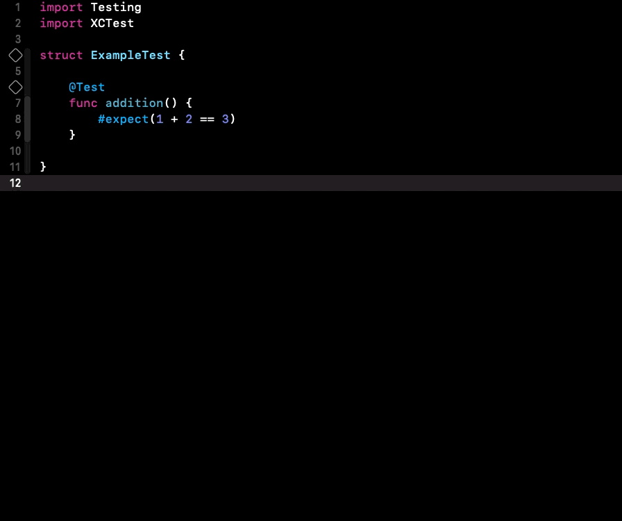

Explain `#` and `@` in Swift - your next interview may have this question! Don't miss it out!

Shortly - `#` and `@` are prefixes for macros in Swift.

What is macro?
💡 Macro is a feature that generates code during compilation. Unlike macros in C, which work like “find and replace”, Swift macros are type-safe and context aware, making them powerful tools reducing boilerplate code.

Two types of macros
1️⃣ attached - use `@` prefix, tied to a declaration adding extra logic to it, like: `@Test`, `@Model`, `@Observable`
2️⃣ freestanding - use `#` prefix, standalone code like `#expect`, `#Predicate`, `#warning`

Example of attached macro ⤵️
```swift
@Test func addition() { // tied to the declaration
    ...
}
```

Example of freestanding macro ⤵️
```swift
@Test func addition() {
    #require(1 + 2 == 3) // not attached to a declaration
}
```


Bonus:
It’s possible to expand macros, especially those defined by you, and check their implementation by right-clicking on a macro and selecting the "Expand Macro" option. ⤵️




