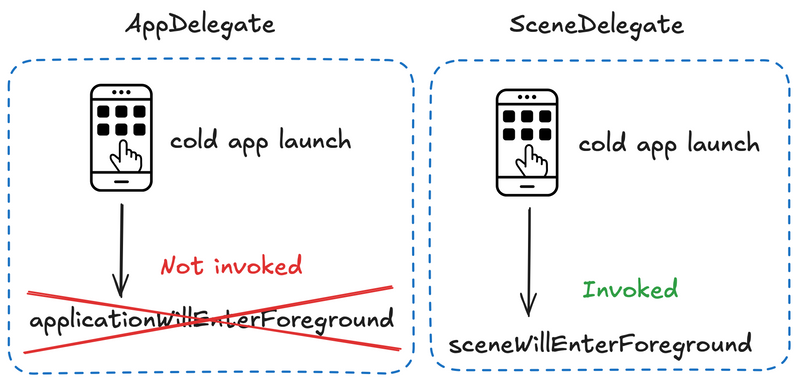

## Intro

All across iOS dev blogs and posts you read about AppDelegate being deprecated in the next major iOS release.
- AppDelegate has been a go-to for app lifecycle handling since iOS 2.
- From iOS 13, SceneDelegate lives alongside AppDelegate handling per-scene lifecycle.

Do the methods `applicationWillEnterForeground` and `sceneWillEnterForeground` actually behave the same?

## Difference 1 - App-wide vs per-scene calls 

- `AppDelegate`’s will enter foreground
    - Fires once when the entire app moves from background to foreground
- `SceneDelegate`’s will enter foreground
    - Fires once per scene as each one enters foreground


This behaviour is reflected in each method’s signature (look on arguments) ⤵️
```swift
// AppDelegate
func applicationWillEnterForeground(_ application: UIApplication) {}

// SceneDelegate
func sceneWillEnterForeground(_ scene: UIScene) {}
```

## Difference 2 - App start behaviour

On a fresh lunch:
- `AppDelegate`’s will enter foreground function is not called
- `SceneDelegate`’s will enter foreground function is called



## Takeaways

- **Migrate with care** - when transferring logic from `AppDelegate` to `SceneDelegate`, remember it now runs per scene and may fire multiple times.
- **Do not assume** - even though both delegates exposes “will enter foreground” method, their behaviour isn’t identical (app start behaviour 👀). 

**Remember** - `AppDelegate` will still stick around for a while. You don’t need to panic and plan ASAP refactors. Always check docs and verify behaviour in your app before making crucial changes.

PDF version ⤵️
[Will enter foreground or won't?](resources/document.pdf)


