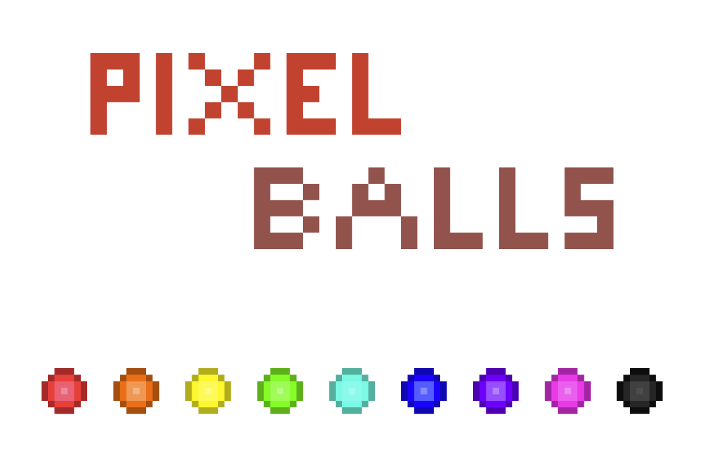
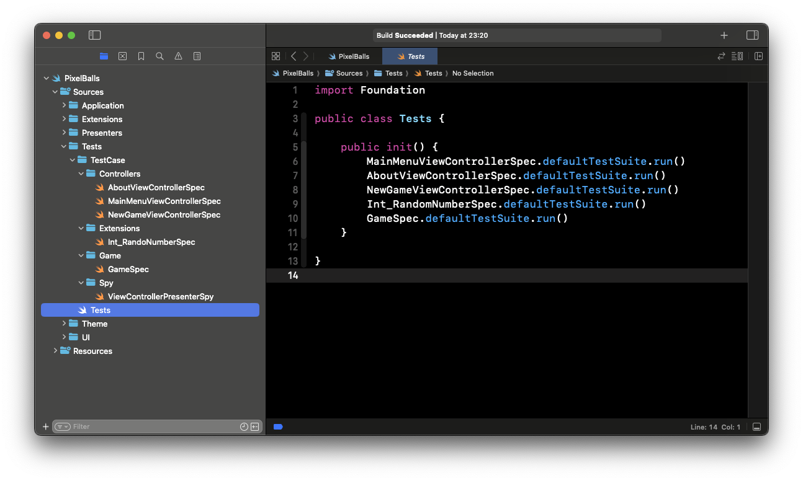
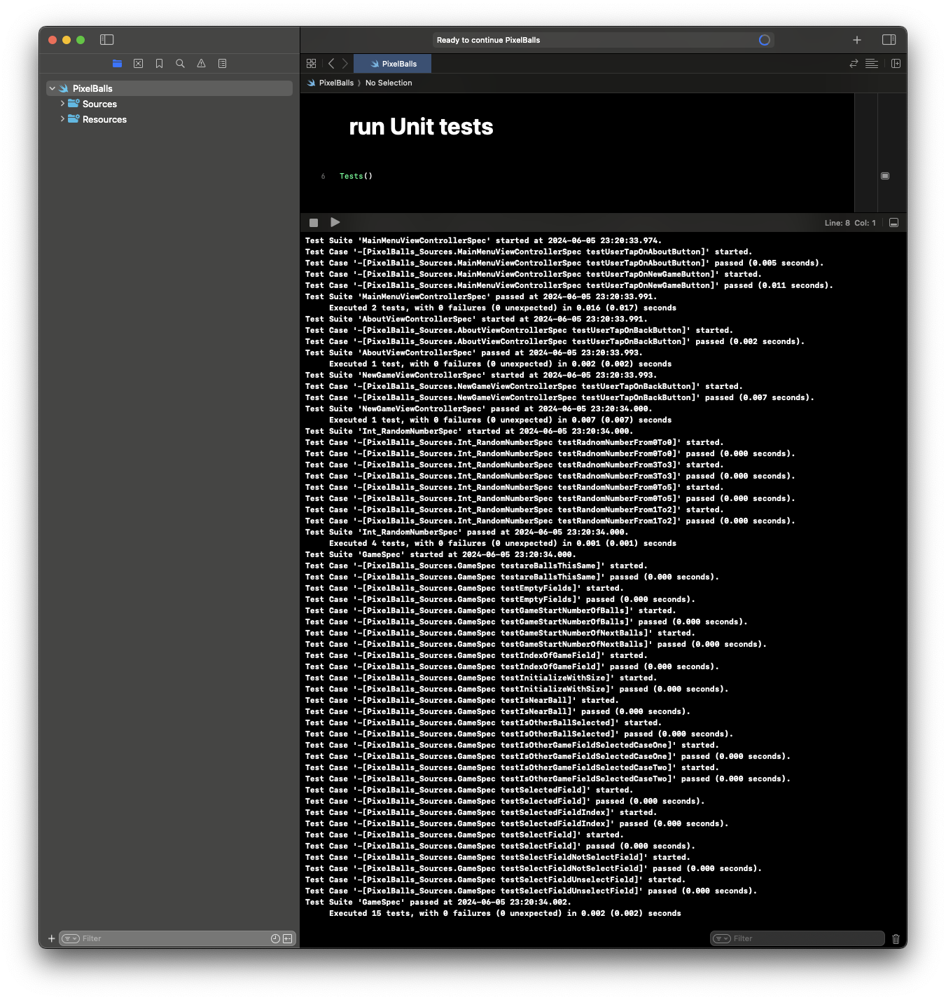
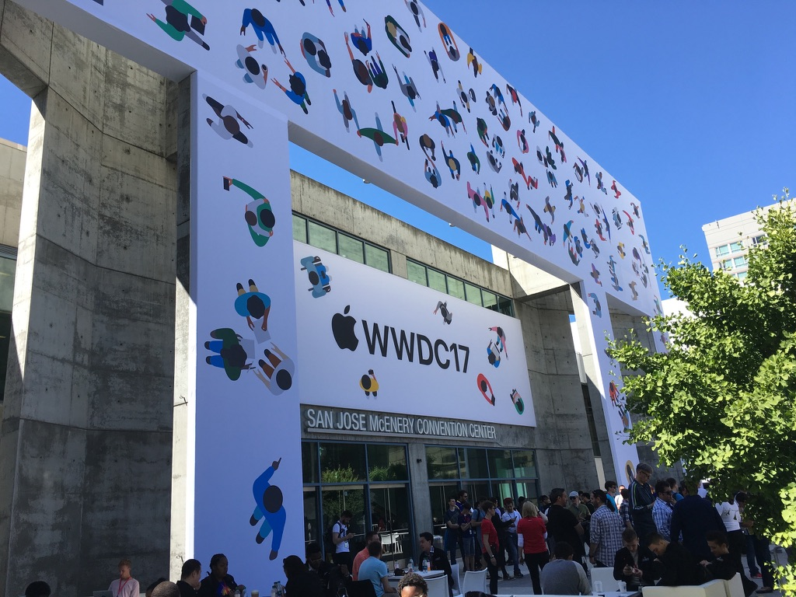

## Intro

Welcome reader!

This year WWDC is super close, and I came up with idea to write about my live WWDC experience. I was the luck one who were eligable for Swift Student Challange

## Pixel Balls

{ describe the game, take it from the playground }



What made my submission unique? In my opinion it was:
- pixel art design

- custom pixel font

- unit tests

## WWDC

Co tam wydali podczas tego WWDC

{ random photos }
---

Thanks for reading the first post on my blog. 📖

I hope you found it useful!

If you enjoy the topic don't forget to follow me on one of my social media or via RSS feed to keep up to speed. 🚀
